# PyMOL para modelagem estrutural
Guia de comandos, visualização e perfis físico-químicos

Curso de Bioinformática Básica, 18 a 20 de agosto de 2026.

Referência de comandos organizada por tema, do primeiro `fetch` à avaliação de um modelo e à figura final. Cada entrada indica o que o comando faz, onde está o equivalente na interface gráfica e por que digitar o comando é mais rápido do que clicar.

Todas as figuras foram geradas com os próprios comandos listados, usando a protease do HIV-1 em complexo com o inibidor amprenavir (PDB 1HPV), um dímero com ligante adequado para discutir interface, bolso de ligação e propriedades de superfície. Onde o efeito de um comando só fica claro por comparação, as figuras aparecem em pares de antes e depois.

17 seções, 76 blocos de comando, 51 figuras, 18 vídeos, estrutura de referência PDB 1HPV.

## Sumário

- [0. Instalar o PyMOL](#0-instalar-o-pymol)
- [1. A interface do PyMOL](#1-a-interface-do-pymol)
- [2. Preparar o ambiente](#2-preparar-o-ambiente)
- [3. Obter e carregar estruturas](#3-obter-e-carregar-estruturas)
- [4. Navegação, câmera e cenas](#4-navegação-câmera-e-cenas)
- [5. Sintaxe de seleção](#5-sintaxe-de-seleção)
- [6. Modos de visualização](#6-modos-de-visualização)
- [7. Cores e esquemas de coloração](#7-cores-e-esquemas-de-coloração)
- [8. Perfil físico-químico I, hidrofobicidade](#8-perfil-físico-químico-i-hidrofobicidade)
- [9. Perfil físico-químico II, carga e potencial eletrostático](#9-perfil-físico-químico-ii-carga-e-potencial-eletrostático)
- [10. Perfil físico-químico III, exposição ao solvente](#10-perfil-físico-químico-iii-exposição-ao-solvente)
- [11. Interações: ligações de hidrogênio, contatos e bolsos](#11-interações-ligações-de-hidrogênio-contatos-e-bolsos)
- [12. Avaliação de modelos](#12-avaliação-de-modelos)
- [13. Renderização, exportação e automação](#13-renderização-exportação-e-automação)
- [14. Armadilhas frequentes](#14-armadilhas-frequentes)
- [15. Roteiro sugerido para a aula](#15-roteiro-sugerido-para-a-aula)
- [16. Curso em vídeo da Schrödinger](#16-curso-em-vídeo-da-schrödinger)

---

## 0. Instalar o PyMOL

Antes da primeira linha de comando, o programa precisa estar na máquina. Há duas rotas gratuitas e elas não são intercambiáveis: a diferença está na licença, não no que o programa faz.

| Rota | Custo e licença | Uso permitido | Plataformas |
| --- | --- | --- | --- |
| **Educational-use-only** (Schrödinger) | Gratuito mediante cadastro. Licença emitida pelo Schrödinger License Manager e válida por prazo determinado | Apenas ensino: aula, exercício e figura de sala. **Não cobre pesquisa nem publicação** | Windows, macOS e Linux, com instalador gráfico |
| **PyMOL open-source** | Gratuito e sem cadastro. Código sob licença permissiva, em [github.com/schrodinger/pymol-open-source](https://github.com/schrodinger/pymol-open-source) | Qualquer uso, incluindo pesquisa e publicação | Windows, macOS e Linux, via conda-forge ou pelo gerenciador de pacotes da distribuição |
| **Academic** ou **Industry** | Assinatura paga | Qualquer uso, com suporte técnico e plugins fechados | Windows, macOS e Linux |

> **Como escolher**  
> Para acompanhar esta aula, a versão educacional basta e é a de instalação mais simples. Para o trabalho que vira dissertação, artigo ou pôster, instale a versão open-source: ela não tem restrição de uso e todos os comandos deste guia funcionam igualmente nas duas. Nada impede ter as duas na mesma máquina.

```
# Rota 1: versao educacional, Windows, macOS ou Linux
# 1. Cadastro    https://pymol.org/edu/
# 2. Licenca     chega por e-mail, arquivo .lic
# 3. Instalador  https://pymol.org/#download
# 4. Ativacao    Help > Install License File, dentro do PyMOL
```

**O que faz.** Registra o aluno ou o professor para receber uma licença de uso educacional sem custo e instala a build oficial da Schrödinger, hoje na versão 3.1.

**Na interface.** O formulário em [pymol.org/edu](https://pymol.org/edu/) pede categoria (student ou teacher), nome, e-mail e instituição. O arquivo de licença chega por e-mail e é carregado em `Help > Install License File`. O instalador de cada sistema está em [pymol.org](https://pymol.org/), na seção Download.

**Ganho de rotina.** É a rota mais curta para uma turma inteira: instalador gráfico, sem terminal e sem compilação. Faça o cadastro alguns dias antes da aula, porque a licença não é emitida no mesmo instante e sem ela o programa abre com funcionalidade reduzida.

> **Atenção**  
> A licença educacional é explícita: cobre instrução em sala e trabalho de casa, e não cobre pesquisa acadêmica nem publicação. Figura que vai para artigo, dissertação ou pôster precisa da versão open-source ou de uma assinatura.

```bash
# Rota 2: open-source em qualquer sistema, via conda-forge
# Instale antes o Miniforge: https://conda-forge.org/download/
conda create -n pymol -c conda-forge pymol-open-source
conda activate pymol
pymol
```

**O que faz.** Cria um ambiente isolado chamado pymol e instala nele o pacote [pymol-open-source](https://anaconda.org/conda-forge/pymol-open-source), com todas as dependências resolvidas.

**Na interface.** Sem equivalente. É a única rota que funciona igual nos três sistemas.

**Ganho de rotina.** O ambiente isolado é o que permite instalar numpy, biopython ou rdkit ao lado do PyMOL sem quebrar o Python do sistema. Trocar de versão é apagar o ambiente e recriá-lo, e o mesmo par de comandos reproduz a instalação em outra máquina.

```bash
# Debian, Ubuntu e derivados
sudo apt install pymol

# Fedora e derivados
sudo dnf install pymol

# Arch Linux
sudo pacman -S pymol
```

**O que faz.** Instala a versão open-source empacotada pela própria distribuição, já integrada ao menu de aplicativos.

**Na interface.** A mesma coisa pela central de aplicativos da distribuição, procurando por PyMOL.

**Ganho de rotina.** É a instalação de um comando em Linux. O preço é a versão: o pacote da distribuição costuma ficar uma ou duas versões atrás do conda-forge, o que importa para settings recentes e não importa para nada neste guia.

```bash
# confere versao e se a janela grafica abre
pymol -cq -d "print(cmd.get_version()[0])"
pymol -d "fetch 1hpv, async=0; show cartoon; util.cbc"
```

**O que faz.** A primeira linha imprime a versão no terminal e sai. A segunda abre a janela, baixa uma estrutura do PDB e a colore por cadeia.

**Na interface.** Menu `Help > About` mostra a versão e a licença ativa.

**Ganho de rotina.** Duas linhas separam três problemas distintos: o programa não instalou, a licença não foi aceita, ou a máquina não tem aceleração gráfica. Peça aos alunos que rodem isso na véspera, porque descobrir em sala que uma das três falhou custa metade da aula.

> **Atenção**  
> Em máquina sem placa dedicada ou em acesso remoto, a janela pode abrir preta ou não abrir. Nesse caso rode `pymol -cq script.pml` em modo sem janela, que é o mesmo modo usado pelo script de figuras da última seção, e veja também [pymolwiki.org](https://pymolwiki.org/index.php/Linux_Install).

---

## 1. A interface do PyMOL

Antes dos comandos, um mapa da janela. Saber onde cada coisa está é o que permite alternar entre clicar e digitar conforme convém: clicar para explorar, digitar para reproduzir.

| Região | O que contém | Uso típico |
| --- | --- | --- |
| **Menu superior** | File, Edit, Build, Movie, Display, Setting, Scene, Mouse, Wizard, Plugin | `File > Open`, `Setting > Edit All` (busca qualquer setting pelo nome), `Plugin` (APBS, alinhamentos) |
| **Linha de comando** | Campo com o prompt `PyMOL>`, logo abaixo do menu | Onde todo comando deste guia é digitado. Setas para cima e para baixo percorrem o histórico |
| **Painel de objetos** (direita) | Um item por objeto e por seleção, com os botões **A S H L C** | **A**ctions, **S**how, **H**ide, **L**abel, **C**olor. Clicar no nome liga e desliga o objeto |
| **Barra inferior direita** | Modo do mouse (3-Button Viewing ou Editing) e o campo `Selecting` | `Selecting` define se o clique seleciona átomo, resíduo, cadeia, objeto ou molécula |
| **Barra inferior esquerda** | Reset, Zoom, Orient, Draw, Ray, Unpick, Deselect, Rock, Get View | Atalhos para os comandos de câmera e renderização |
| **Faixa de sequência** (topo) | Sequência de aminoácidos, ativada por `set seq_view, 1` ou `Display > Sequence` | Clicar em um resíduo o adiciona à seleção `sele` |

> **Princípio geral**  
> Todo clique na interface gera o comando equivalente, que é impresso no painel de texto (tecle `Esc` para alternar entre a janela 3D e o log). Essa é a forma mais eficiente de aprender a sintaxe: faça pela interface, leia o comando gerado, digite o comando na próxima vez. Com `log_open aula.pml` ativo, essa sequência de comandos fica gravada em um script reproduzível.

---

## 2. Preparar o ambiente

Ajustes feitos uma vez, no início da sessão. Em sala valem duplamente, porque há projetor, máquinas heterogêneas e alunos que ainda não dominam o mouse.

```pml
set seq_view, 1
```

**O que faz.** Exibe a sequência de aminoácidos em uma faixa no topo da janela; clicar em um resíduo o adiciona à seleção sele.

**Na interface.** Menu `Display > Sequence` (e `Display > Sequence Mode` para alternar entre resíduo, cadeia e átomo).

**Ganho de rotina.** É a ponte entre pensar em sequência e enxergar em estrutura. Para o aluno que ainda não domina a sintaxe de seleção, substitui o comando select inteiro por um clique, e o comando gerado aparece no log servindo de exemplo.

```pml
bg_color white
set ray_opaque_background, 0
```

**O que faz.** Fundo branco na tela; fundo transparente nas imagens exportadas com ray.

**Na interface.** `Display > Background > White` e `Display > Background > Opaque` (desmarcar).

**Ganho de rotina.** Duas linhas no ~/.pymolrc e nunca mais se refaz esse ajuste. Fundo transparente evita o retângulo branco ao colar a figura em slides de qualquer cor.

```pml
set orthoscopic, on
set depth_cue, 0
set ray_shadows, 0
```

**O que faz.** Projeção ortográfica, sem névoa de profundidade e sem sombras projetadas.

**Na interface.** `Display > Orthoscopic View`, `Display > Depth Cue`, `Setting > Rendering > Shadows`.

**Ganho de rotina.** Perspectiva e névoa distorcem a percepção de distância: dois resíduos que parecem próximos podem estar afastados no eixo z. Para uma discussão sobre contatos e geometria, a projeção ortográfica é mais honesta e ainda melhora o contraste em projetor.

```pml
util.performance(100)   # maquinas modestas ou projetor
util.performance(0)     # qualidade maxima para a figura final
```

**O que faz.** Ajusta em bloco os parâmetros de qualidade de renderização, sendo 0 o máximo e 100 o mais rápido.

**Na interface.** `Setting > Rendering > Performance` (Maximum Quality ou Maximum Performance).

**Ganho de rotina.** Um comando substitui meia dúzia de settings. Evita travar a aula quando alguém abre a superfície de um sistema grande num notebook modesto; volte a 0 só no momento de gerar a figura.

```pml
viewport 1200, 900
```

**O que faz.** Define o tamanho da área de visualização em pixels, independentemente do tamanho da janela.

**Na interface.** Não existe equivalente por clique, apenas redimensionar a janela manualmente.

**Ganho de rotina.** Fixa a proporção da imagem. Com o mesmo viewport em todas as máquinas, o enquadramento salvo com get_view é reproduzido de forma idêntica, o que é impossível de garantir arrastando bordas de janela.

```pml
reinitialize
```

**O que faz.** Reinicia o PyMOL ao estado de partida: apaga objetos, seleções, cenas e todos os settings.

**Na interface.** `File > Reinitialize > Everything`.

**Ganho de rotina.** Começar cada bloco com estado limpo elimina a classe inteira de bugs causados por um setting esquecido do exercício anterior. Use `delete all` quando quiser apagar objetos e preservar os settings.

---

## 3. Obter e carregar estruturas

O PyMOL baixa estruturas do PDB sem passar pelo navegador. É o ponto de partida natural e já introduz a distinção entre unidade assimétrica e montagem biológica.

```pml
fetch 1hpv
```

**O que faz.** Baixa a entrada 1HPV do RCSB (mmCIF por padrão) e a carrega como objeto de mesmo nome.

**Na interface.** `File > Get PDB...`, digitar o código na caixa de diálogo.

**Ganho de rotina.** Substitui a sequência abrir navegador, buscar no RCSB, baixar, descompactar, localizar o arquivo e abrir. São seis passos trocados por sete caracteres, e o nome do objeto já vira o código PDB, o que mantém a sessão autodocumentada.

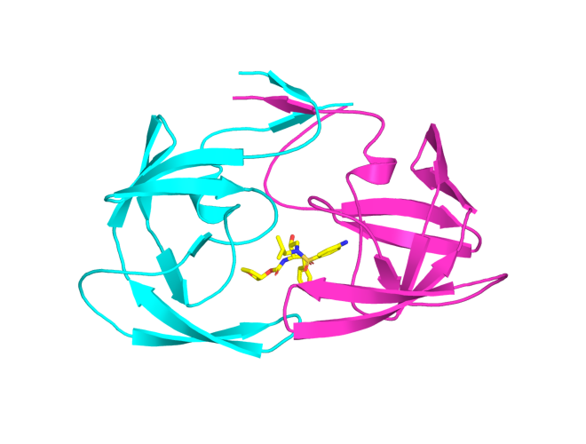

*Fig. 1. Resultado de `fetch 1hpv` seguido de `show cartoon` e `util.cbc`. A protease do HIV-1 é um homodímero, com o inibidor amprenavir em amarelo no eixo de simetria.*

```pml
fetch 1hpv 1ubq 4hhb, async=0
```

**O que faz.** Baixa várias entradas de uma vez; async=0 faz o PyMOL aguardar o término do download antes de executar a próxima linha.

**Na interface.** Uma caixa de diálogo por estrutura, sem opção de download síncrono.

**Ganho de rotina.** Preparar uma aula com cinco estruturas passa a ser uma linha. O async=0 é obrigatório dentro de scripts: sem ele, os comandos seguintes rodam sobre um objeto que ainda não terminou de carregar.

> **Atenção**  
> Sintoma clássico do esquecimento: `Selector-Error: Invalid selection name` logo após um fetch dentro de um script.

```pml
fetch 1hpv, type=pdb1
```

**O que faz.** Baixa a primeira montagem biológica (biological assembly) em vez da unidade assimétrica.

**Na interface.** Não existe equivalente; pela interface é preciso baixar o arquivo correto do site do RCSB manualmente.

**Ganho de rotina.** Além de rápido, evita um erro conceitual comum. O conteúdo do arquivo cristalográfico é a unidade assimétrica, que pode conter meia molécula, uma ou várias, e frequentemente não corresponde ao oligômero funcional. Comparar as duas versões lado a lado é um dos melhores momentos da aula.

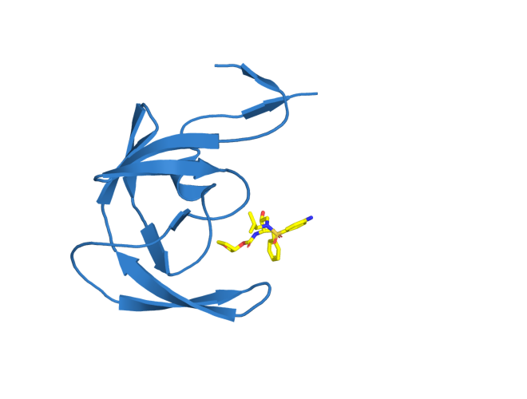

*Fig. 2. **Apenas uma cadeia.** O sítio ativo aparece incompleto e o inibidor fica pendurado no vazio, sem a segunda metade do bolso.*


*Fig. 3. **Dímero completo.** O sítio ativo é formado pela interface das duas cadeias; a unidade funcional só existe na montagem biológica.*

```pml
set assembly, 1
fetch 6lu7, async=0
split_states 6lu7
```

**O que faz.** Faz o mmCIF ser carregado já expandido na montagem 1; split_states separa as cópias em objetos independentes.

**Na interface.** Sem equivalente.

**Ganho de rotina.** É a alternativa moderna ao type=pdb1 e a única que funciona para entradas grandes sem formato PDB legado. Após split_states cada protômero pode ser colorido, movido e analisado separadamente, o que seria inviável com tudo em um objeto só.

```pml
set fetch_path, /caminho/para/aula
```

**O que faz.** Define o diretório onde os arquivos baixados são gravados e onde o PyMOL procura antes de baixar de novo.

**Na interface.** Sem equivalente prático.

**Ganho de rotina.** Baixe todas as estruturas na véspera nesse diretório. Se a rede da sala cair, o fetch encontra o arquivo em cache e a aula continua sem interrupção. Também evita espalhar arquivos pelo diretório de onde o PyMOL foi iniciado.

```pml
load modelo.pdb, meu_modelo
load predicao.cif, af_model
```

**O que faz.** Carrega um arquivo local; o segundo argumento define o nome do objeto.

**Na interface.** `File > Open...`, em que o nome do objeto é sempre derivado do nome do arquivo.

**Ganho de rotina.** Nomear no ato de carregar é o que torna os comandos seguintes legíveis. Em modelagem você compara modelo contra molde dezenas de vezes: `align modelo, molde` se escreve sozinho, `align rank1_relaxed_model_3_ptm, 6xyz_chainA` não.

```pml
load https://alphafold.ebi.ac.uk/files/AF-P69905-F1-model_v4.pdb, hbb_af
```

**O que faz.** Carrega uma estrutura diretamente de uma URL, sem download prévio.

**Na interface.** Sem equivalente; é preciso baixar pelo navegador e depois abrir.

**Ganho de rotina.** Traz um modelo do AlphaFold DB para a sessão em um comando, permitindo comparar predição e estrutura experimental imediatamente. O B-factor desse arquivo carrega o pLDDT, tratado na seção de avaliação de modelos.

```pml
save saida.pdb, polymer and chain A
save aula.pse
```

**O que faz.** Grava uma seleção como arquivo de coordenadas; grava a sessão completa como .pse.

**Na interface.** `File > Save Molecule...` e `File > Save Session As...`.

**Ganho de rotina.** Pela interface, exportar um subconjunto exige antes criar um objeto novo com as Actions do painel. Pelo comando, a seleção vai direto no argumento. O .pse preserva objetos, cores, representações, câmera e cenas, sendo o formato ideal para distribuir a aula pronta aos alunos.

> **Atenção**  
> O .pse é específico do PyMOL. Para entregar coordenadas a outro programa, salve .pdb ou .cif.

---

## 4. Navegação, câmera e cenas

Controlar o ponto de vista é metade da habilidade de visualização. Os comandos de câmera também são o que torna uma figura reproduzível.

| Mouse | Ação | Observação |
| --- | --- | --- |
| Botão esquerdo, arrastar | Rotaciona a cena | Rotação em torno do centro definido por `center` ou `zoom` |
| Botão do meio, arrastar | Translada (pan) | Move a molécula no plano da tela |
| Botão direito, arrastar na vertical | Zoom | Aproxima ou afasta a câmera |
| Roda do mouse | Move os planos de corte (clipping) | Se a molécula sumir da tela, quase sempre é isto. Corrija com `clip slab, 200` ou `reset` |
| Clique esquerdo em um átomo | Adiciona à seleção `sele` | O nível do clique é escolhido no campo `Selecting`, no canto inferior direito |
| `Ctrl` e clique do meio | Centraliza no átomo clicado | Equivale a `center` naquele ponto |

```pml
orient polymer
```

**O que faz.** Alinha o maior eixo de inércia da seleção com a horizontal da tela e enquadra a molécula.

**Na interface.** Botão `Orient` na barra inferior esquerda, ou `A > orient` no painel de objetos.

**Ganho de rotina.** Resolve em um comando o problema de a molécula estar atravessada na tela, e de forma determinística: a mesma orientação em qualquer máquina. Ajustar o mesmo ângulo arrastando o mouse leva vinte segundos e não é reproduzível.

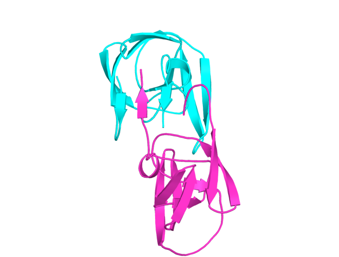

*Fig. 4. **Antes.** Apenas `zoom`, com a orientação em que a estrutura foi depositada. O dímero aparece de viés e a simetria fica ilegível.*

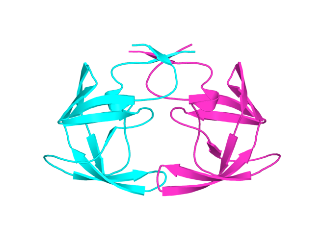

*Fig. 5. **Depois.** `orient polymer` alinha o maior eixo de inércia com a horizontal e a organização das duas cadeias fica evidente.*

```pml
zoom resi 25, 5
zoom organic, 8, animate=2
```

**O que faz.** Enquadra a seleção com uma margem em ångströms; animate faz a transição em segundos em vez de saltar.

**Na interface.** `A > zoom` no painel de objetos, sem controle sobre a margem nem sobre a animação.

**Ganho de rotina.** A margem controla explicitamente quanto contexto entra na figura, o que pela interface só se consegue por tentativa e erro com o mouse. A animação evita que a plateia se perca ao saltar da visão global para o sítio ativo.

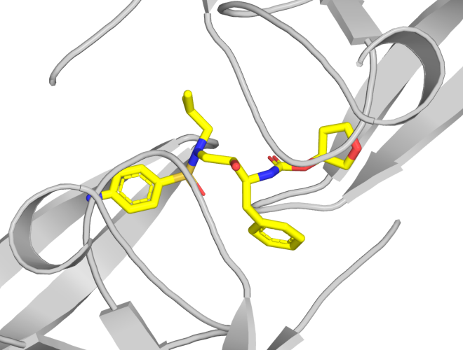

*Fig. 6. `zoom organic, 2`. Margem pequena, foco no ligante, sem contexto estrutural ao redor.*

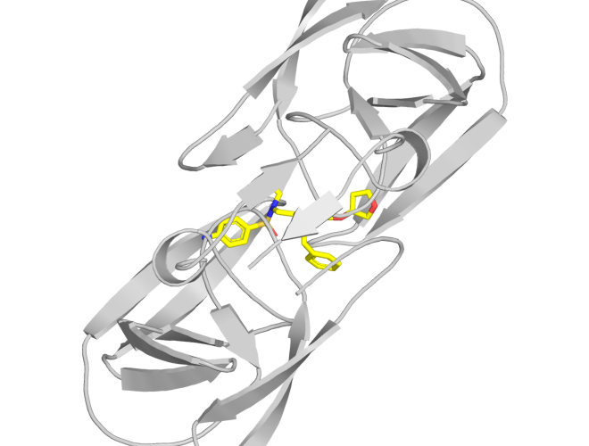

*Fig. 7. `zoom organic, 12`. Margem grande, o ligante aparece situado dentro do bolso e da estrutura do dímero.*

```pml
center resi 25
reset
```

**O que faz.** Define o centro de rotação sem alterar o zoom; reset devolve a visão inicial completa.

**Na interface.** `Ctrl` e clique do meio no átomo; botão `Reset` na barra inferior.

**Ganho de rotina.** Girar em torno do sítio ativo, e não do centro de massa da proteína, muda completamente a facilidade de inspecionar um bolso. Fazer isso por comando permite guardá-lo dentro de um alias ou script.

```pml
turn x, 90
turn y, 180
move z, -20
```

**O que faz.** Rotaciona a câmera em torno de um eixo, em graus, ou a desloca ao longo de um eixo, em ångströms.

**Na interface.** Só arrastando o mouse, sem controle numérico.

**Ganho de rotina.** Indispensável para figuras com vistas frontal e posterior: `turn y, 180` garante exatamente 180 graus. Arrastando o mouse, as duas vistas nunca ficam exatamente opostas e a comparação perde rigor.

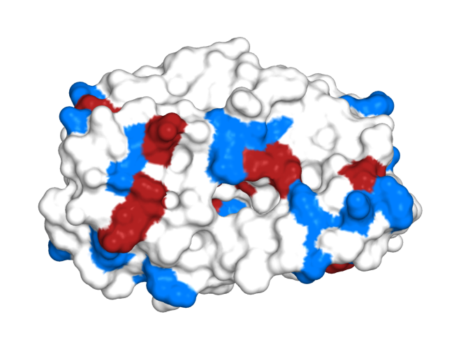

*Fig. 8. **Face frontal.** Superfície com ácidos em vermelho e básicos em azul.*

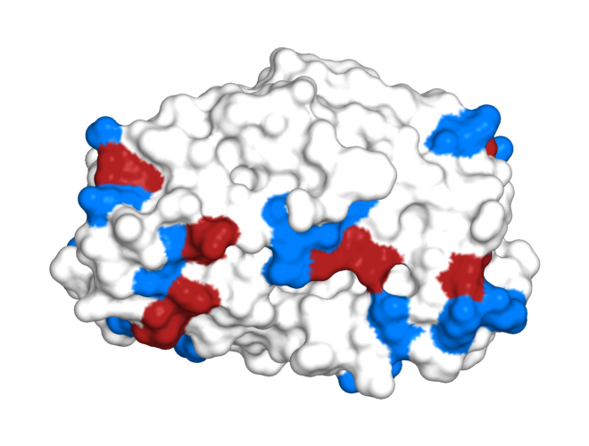

*Fig. 9. **Face posterior**, obtida com `turn y, 180`. A distribuição de carga é claramente assimétrica entre as duas faces.*

```pml
clip slab, 15
clip slab, 200
```

**O que faz.** Restringe a renderização a uma fatia de espessura definida em torno do plano focal. O segundo comando desfaz o corte.

**Na interface.** Roda do mouse, ou `Display > Clip`, ambos sem controle numérico.

**Ganho de rotina.** Cortar uma fatia é a forma mais clara de mostrar o interior de um canal, de um poro ou o núcleo hidrofóbico sem remover átomos. Com valor numérico, a mesma fatia é reproduzida em todas as figuras da série.

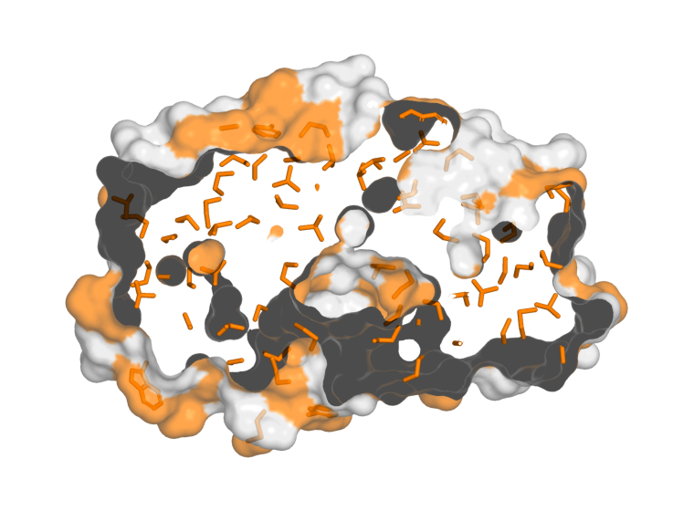

*Fig. 10. `clip slab, 14` com superfície semitransparente e as cadeias laterais apolares em laranja. O núcleo apolar denso e a casca polar ficam visíveis na mesma imagem.*

```pml
get_view

set_view (\
     0.529, -0.163,  0.833,\
     0.244,  0.969,  0.035,\
    -0.812,  0.185,  0.552,\
     0.000,  0.000, -152.7,\
    30.10,  28.65,  15.44,\
   120.30, 185.10,  -20.0 )
```

**O que faz.** get_view imprime a matriz de câmera atual, com 18 valores; set_view a restaura exatamente.

**Na interface.** Botão `Get View` na barra inferior copia a matriz para a área de transferência. Não há botão para aplicá-la de volta.

**Ganho de rotina.** É o mecanismo de reprodutibilidade de figuras. Cole o bloco impresso no seu script e o mesmo ângulo é reproduzido em qualquer máquina, meses depois. Sem isso, refazer uma figura de artigo depois da revisão significa reencontrar o ângulo no olho.

```pml
scene 01_global, store
scene 02_sitio, store
scene 01_global, recall
scene auto, next
```

**O que faz.** Armazena e recupera o conjunto completo de câmera, representações, cores e visibilidade sob um nome.

**Na interface.** `Scene > Store` e `Scene > Recall`; teclas `F1` a `F12` para armazenar e recuperar rapidamente.

**Ganho de rotina.** É o recurso de aula por excelência. Prepare cinco ou seis cenas na véspera e navegue entre elas durante a exposição com `Page Up` e `Page Down`, sem digitar nada. Cada cena vira um slide da estrutura, com zero risco de erro de digitação ao vivo.

---

## 5. Sintaxe de seleção

A linguagem de seleção é o núcleo do PyMOL: todo comando de representação, cor e medida opera sobre uma seleção. É o investimento com maior retorno de toda a aula.

| Identificador | Significado | Exemplo |
| --- | --- | --- |
| `chain` | Cadeia | `chain A` |
| `resi` | Número do resíduo, aceita faixa e lista | `resi 10-50+87` |
| `resn` | Nome do resíduo | `resn ARG+LYS` |
| `name` | Nome do átomo | `name CA+CB` |
| `elem` | Elemento químico | `elem Zn` |
| `ss` | Estrutura secundária (H, S, L) | `ss H+S` |
| `b`, `q` | B-factor e ocupância | `b < 30`, `q < 1` |
| `alt` | Confôrmero alternativo | `alt A+""` |

| Atalho | Seleciona |
| --- | --- |
| `polymer` | Cadeia polimérica: proteína e ácido nucleico |
| `polymer.protein` ou `polymer.nucleic` | Só proteína ou só ácido nucleico |
| `organic` | Moléculas orgânicas pequenas: ligantes, cofatores, crioprotetores |
| `inorganic` ou `metals` | Íons e sais, ou apenas metais |
| `solvent` | Águas |
| `hydro` | Hidrogênios |
| `backbone` ou `sidechain` | Cadeia principal ou cadeia lateral |
| `donors` ou `acceptors` | Doadores ou aceptores de ligação de hidrogênio |
| `hetatm` | Registros HETATM do arquivo |

```pml
select sitio, byres (polymer within 5 of organic)
```

**O que faz.** within seleciona átomos a até 5 Å do ligante; byres expande a seleção para os resíduos inteiros.

**Na interface.** Selecionar o ligante, depois `A > modify > around > residues within 5 A`. São quatro submenus e a seleção resultante recebe um nome automático como sel01.

**Ganho de rotina.** É o comando mais usado da aula e o exemplo mais claro do ganho: quatro níveis de menu contra uma linha, com o nome escolhido por você. Ao contrário do menu, a linha pode ser reaproveitada em qualquer estrutura mudando um argumento.

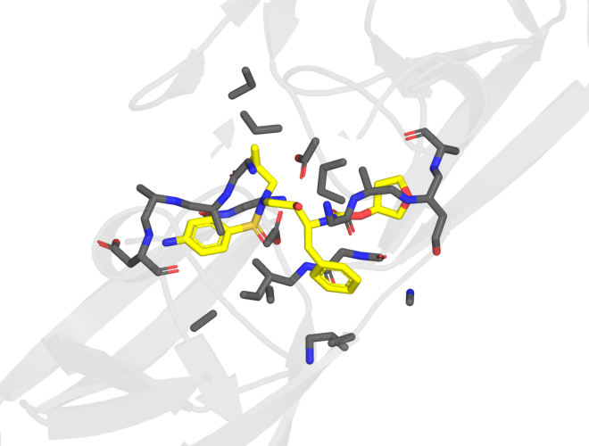

*Fig. 11. **Sem byres.** Só os átomos dentro do raio de 5 Å entram na seleção, e as cadeias laterais aparecem cortadas ao meio, com ligações penduradas no vazio.*

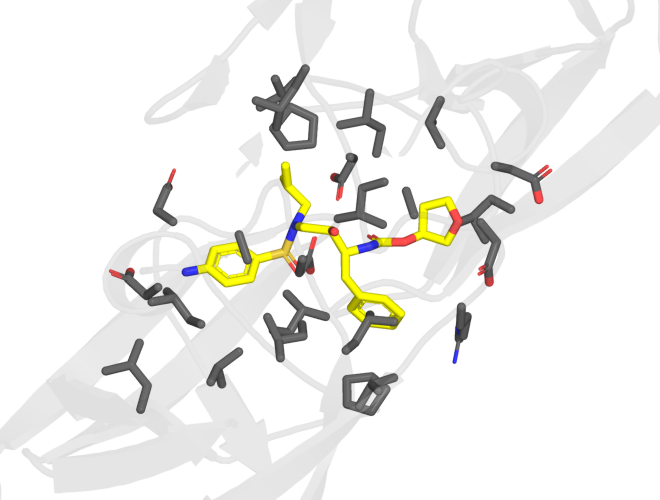

*Fig. 12. **Com byres.** A seleção é expandida para os resíduos completos e cada cadeia lateral aparece inteira, pronta para discutir a química do bolso.*

> **Atenção**  
> Regra prática: quase toda seleção por distância deve ser envolvida em byres. Note ainda que `within` inclui os átomos da própria referência quando satisfazem o critério, enquanto `around` os exclui.

```pml
select interface, byres (chain A within 4.5 of chain B)
```

**O que faz.** Resíduos da cadeia A com ao menos um átomo a até 4,5 Å da cadeia B.

**Na interface.** Sem equivalente direto; exige criar seleções intermediárias uma a uma.

**Ganho de rotina.** Define operacionalmente a interface de um complexo em uma linha, com o critério explícito no comando. Isso torna a definição auditável, porque o valor 4,5 Å está escrito ali e pode ser discutido, ao contrário de uma seleção feita a cliques.

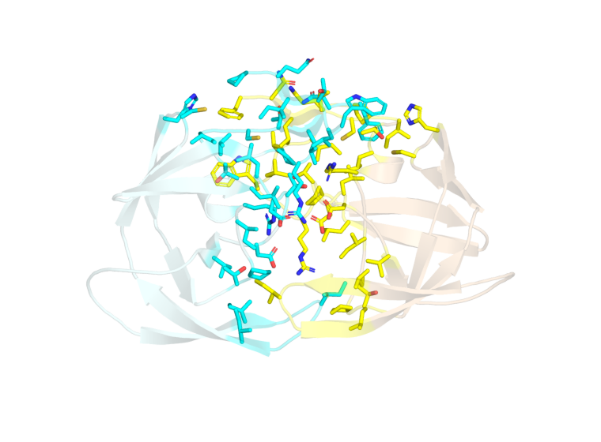

*Fig. 13. Resíduos de interface do dímero, com carbonos ciano na cadeia A e amarelos na cadeia B, sobre cartoon translúcido.*

```pml
select flexivel, byres (name CA and b > 60)
select confiavel, byres (name CA and b < 30)
```

**O que faz.** Seleciona resíduos por faixa de B-factor usando apenas o Cα como critério.

**Na interface.** Sem equivalente, porque não há filtro numérico na interface.

**Ganho de rotina.** Toda uma classe de perguntas quantitativas fica acessível por seleção. Usar `name CA` evita que um único átomo terminal de cadeia lateral com B alto arraste o resíduo inteiro.

```pml
select viz, byres (resi 25 around 5)
select prox, byres ((resi 25 expand 4) and resn ARG+LYS)
```

**O que faz.** around exclui a seleção de origem; expand a inclui, expandindo o raio de busca.

**Na interface.** `A > modify > around` e `A > modify > expand`.

**Ganho de rotina.** A distinção decide se o resíduo de interesse aparece ou não na figura final. Errar aqui é a causa mais comum de imagens em que o resíduo central simplesmente sumiu.

```pml
/1hpv//A/25/CA
1hpv//A/25/
A/25-50/
```

**O que faz.** Sintaxe de macro no formato objeto/segmento/cadeia/resíduo/átomo; campos vazios funcionam como coringas.

**Na interface.** Sem equivalente.

**Ganho de rotina.** Muito mais curta que a forma extensa, o que importa em comandos de medida onde há duas ou quatro seleções na mesma linha. Compare `/1hpv//A/25/OD1` com `1hpv and chain A and resi 25 and name OD1`.

```pml
count_atoms polymer
iterate name CA and chain A, print(resi, resn, round(b,1))
```

**O que faz.** Conta átomos da seleção; iterate percorre a seleção executando código Python por átomo.

**Na interface.** Sem equivalente.

**Ganho de rotina.** iterate transforma o PyMOL em ferramenta de extração de dados: exportar B-factors, listar os resíduos de uma interface, gerar uma tabela para análise posterior. É a ponte natural entre visualização e análise em Python, e não há como fazer isso clicando.

```pml
indicate resn HOH
deselect
```

**O que faz.** Marca temporariamente uma seleção com quadrados rosa, sem criar objeto de seleção; deselect limpa.

**Na interface.** `A > indicate`.

**Ganho de rotina.** Ideal para verificar o que exatamente uma expressão captura antes de aplicar cor ou representação, sem poluir o painel lateral com dezenas de seleções descartáveis que depois precisam ser apagadas uma a uma.

---

## 6. Modos de visualização

Cada representação privilegia uma informação e esconde outra. O objetivo é que o aluno escolha a representação em função da pergunta, e não por hábito.

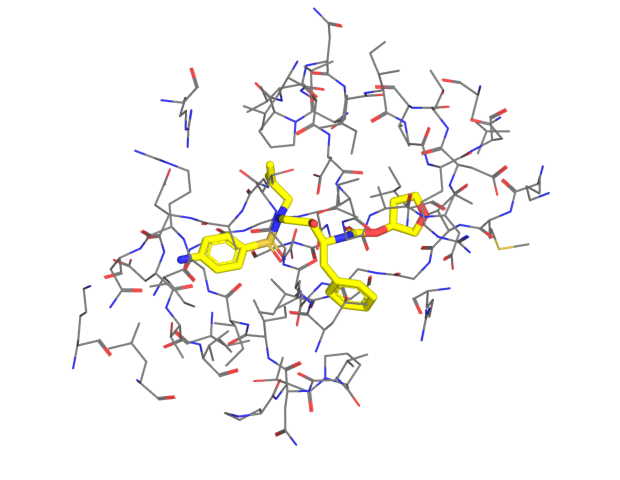

*Fig. 14. **lines**, todos os átomos em traço fino. Barato, bom para inspeção rápida*

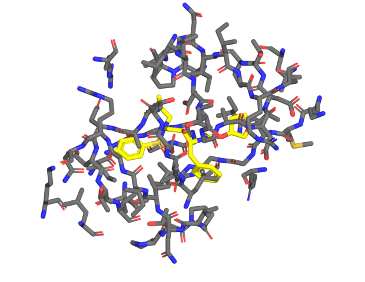

*Fig. 15. **sticks**, conectividade e geometria. Padrão para sítio ativo e ligante*

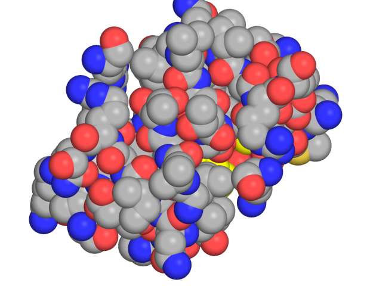

*Fig. 16. **spheres**, raio de van der Waals. Mostra empacotamento e volume real ocupado*

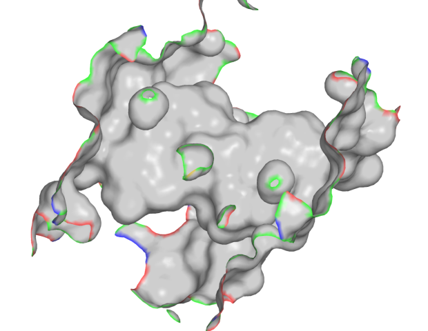

*Fig. 17. **surface**, superfície molecular. Forma, bolsos e propriedades da face acessível*

| Representação | Mostra | Quando usar |
| --- | --- | --- |
| `cartoon` | Topologia e estrutura secundária | Visão global do enovelamento; fundo de quase toda figura |
| `lines` | Todos os átomos, traço fino | Inspeção rápida; barato computacionalmente |
| `sticks` | Ligações e conectividade | Sítio ativo, ligante, cadeias laterais em detalhe |
| `spheres` | Raio de van der Waals | Empacotamento, volume ocupado, contatos estéricos |
| `surface` | Superfície molecular contínua | Forma, bolsos, propriedades físico-químicas da face acessível |
| `mesh` ou `dots` | Superfície em malha ou em pontos | Mostrar superfície e conteúdo interno ao mesmo tempo |
| `ribbon` | Traço fino pelos Cα | Sistemas muito grandes, onde cartoon fica pesado |
| `nb_spheres` | Esferas para átomos sem ligação | Íons e águas, que em sticks ficam praticamente invisíveis |

```pml
hide everything
show cartoon, polymer
show sticks, organic
show nb_spheres, inorganic
```

**O que faz.** Limpa a cena e a reconstrói camada por camada.

**Na interface.** `H > everything` seguido de `S > cartoon`, e assim por diante, objeto por objeto.

**Ganho de rotina.** Quatro linhas contra doze cliques distribuídos por vários objetos, e o bloco pode ser colado de novo a qualquer momento para voltar ao estado conhecido. Ensinar a sempre começar por hide everything evita o acúmulo de representações que transforma a cena em sopa visual, o erro número um de quem está aprendendo.

```pml
as cartoon, polymer
show sticks, resi 25
```

**O que faz.** as (abreviação de show_as) substitui todas as representações da seleção; show acrescenta uma.

**Na interface.** `S > as > cartoon` contra `S > cartoon`.

**Ganho de rotina.** Distinção que economiza muitos hide. Use as para definir a representação base do objeto e show para acrescentar detalhes pontuais.

```pml
set cartoon_side_chain_helper, 1
show cartoon, polymer
show sticks, byres (polymer within 4.5 of organic) and not hydro
```

**O que faz.** Suprime o desenho do cartoon nos átomos de cadeia principal cujas cadeias laterais estão em sticks.

**Na interface.** `Setting > Cartoon > Side Chain Helper`.

**Ganho de rotina.** É o setting com melhor relação entre uma linha digitada e qualidade da figura. Sem ele, o cartoon atravessa as cadeias laterais e a imagem fica ilegível exatamente na região de interesse, problema que custa muito tempo para diagnosticar quando não se conhece o setting.

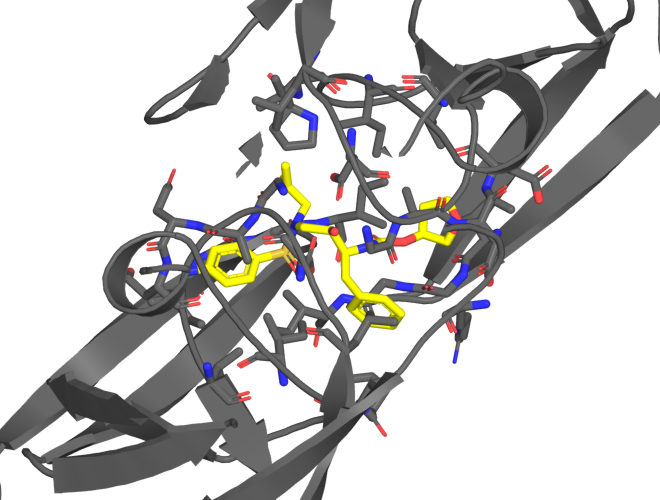

*Fig. 18. **Desligado.** O cartoon azul atravessa as cadeias laterais e cria um emaranhado no centro da figura, exatamente sobre o sítio ativo.*

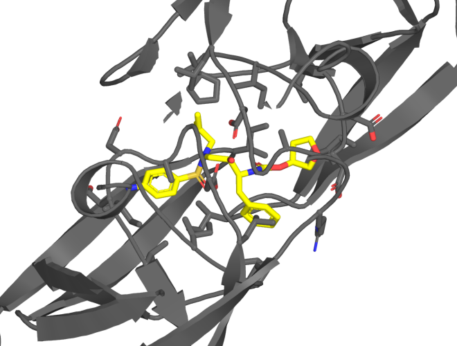

*Fig. 19. **Ligado.** O cartoon recua nos trechos com sticks visíveis e a geometria de cada cadeia lateral fica legível.*

```pml
dss
rebuild
```

**O que faz.** Recalcula a atribuição de estrutura secundária a partir das coordenadas.

**Na interface.** Sem equivalente por clique.

**Ganho de rotina.** Modelos vindos de modelagem comparativa, docking ou dinâmica molecular frequentemente não trazem registros HELIX e SHEET, e o cartoon sai todo em loop. Sem conhecer dss, a reação típica é achar que o modelo está errado. Também permite discutir que a atribuição é um algoritmo sobre geometria, não um dado experimental.

```pml
show surface, polymer
set transparency, 0.5
show cartoon, polymer
```

**O que faz.** Superfície semitransparente sobre o cartoon opaco.

**Na interface.** `S > surface` e `Setting > Transparency > Surface > 50%`.

**Ganho de rotina.** Combinação mais informativa da aula, e uma das mais tediosas de montar a cliques porque a transparência está três níveis dentro do menu Setting. Mostra simultaneamente a forma externa e o enovelamento interno.

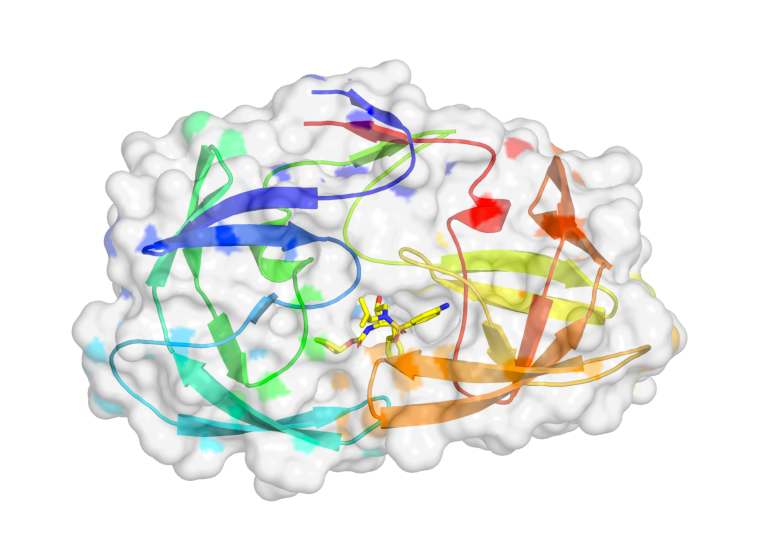

*Fig. 20. Superfície a 55% de transparência sobre cartoon colorido do N-terminal (azul) ao C-terminal (vermelho), com o inibidor em amarelo.*

```pml
set solvent_radius, 1.4
rebuild

set solvent_radius, 5.0
rebuild
```

**O que faz.** Define o raio da sonda usada para construir a superfície, em ångströms.

**Na interface.** Só por `Setting > Edit All`, buscando o nome do setting.

**Ganho de rotina.** O raio padrão de 1,4 Å corresponde a uma molécula de água. Aumentá-lo suaviza a superfície e revela apenas depressões grandes o bastante para acomodar um ligante, o que é um experimento conceitual de dez segundos por comando e praticamente inacessível pela interface.

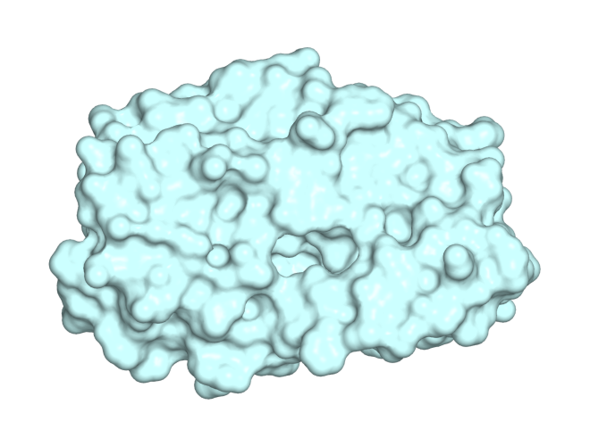

*Fig. 21. **Sonda de 1,4 Å**, equivalente a uma molécula de água. Toda a rugosidade atômica da superfície é preservada.*

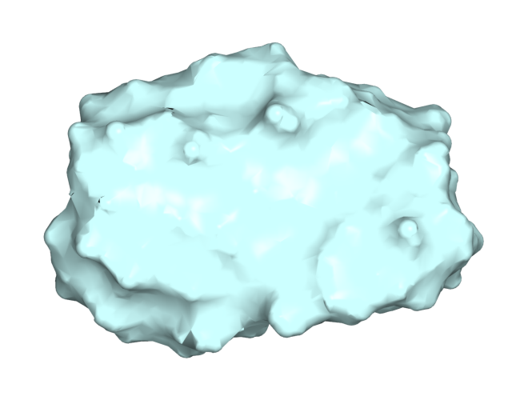

*Fig. 22. **Sonda de 5,0 Å.** As reentrâncias pequenas desaparecem e restam apenas as depressões capazes de acomodar um ligante.*

```pml
set surface_cavity_mode, 1
set surface_cavity_radius, 5
set surface_cavity_cutoff, -5
show surface, polymer
rebuild
```

**O que faz.** Faz a superfície exibir apenas cavidades e bolsos internos, ocultando a face externa.

**Na interface.** Só por `Setting > Edit All`, buscando cada nome de setting individualmente.

**Ganho de rotina.** Visualiza bolsos de ligação sem nenhuma ferramenta externa. Variar o raio em sala mostra que a definição de bolso é dependente de parâmetro, uma lição que se perde quando o resultado vem pronto de um servidor web.

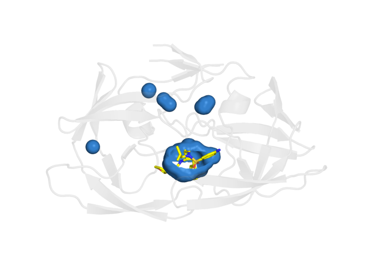

*Fig. 23. Com `surface_cavity_mode 1`, apenas as cavidades internas são renderizadas. A maior delas envolve o inibidor, em amarelo, no eixo de simetria do dímero.*

> **Atenção**  
> É um recurso de visualização, não de análise: não fornece volume, ranking nem escore. Para isso, use fpocket, CASTp ou equivalente.

```pml
set ray_trace_mode, 1
set ray_trace_color, black
set antialias, 2
```

**O que faz.** Adiciona contorno preto aos objetos na renderização, no estilo de desenho técnico.

**Na interface.** `Setting > Rendering > Ray Trace Mode`.

**Ganho de rotina.** Melhora muito a legibilidade em projeção e em impressão preto e branco, separando visualmente objetos sobrepostos. Modos 2 e 3 dão variantes em preto e branco e contorno mais espesso.

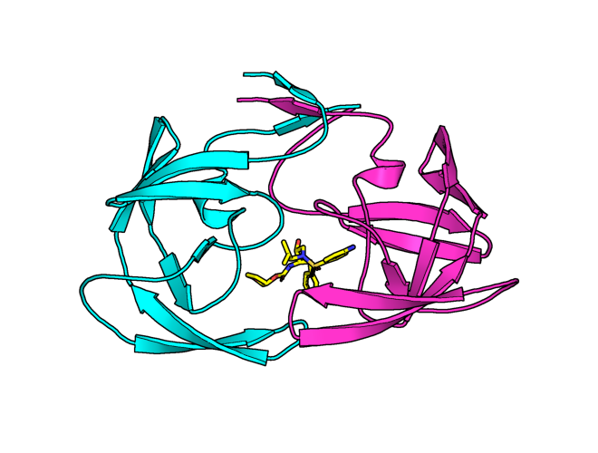

*Fig. 24. Mesma cena com `ray_trace_mode 1`. O contorno preto separa as duas cadeias e destaca o ligante mesmo em projeção de baixo contraste.*

```pml
preset.publication("1hpv")
preset.ball_and_stick("organic")
preset.technical("1hpv")
```

**O que faz.** Aplica conjuntos predefinidos de representação e settings ao objeto ou seleção.

**Na interface.** `A > preset > publication`.

**Ganho de rotina.** Ponto de partida instantâneo quando não se sabe por onde começar. preset.publication já liga sombras, antialiasing e hélices estilizadas de uma vez.

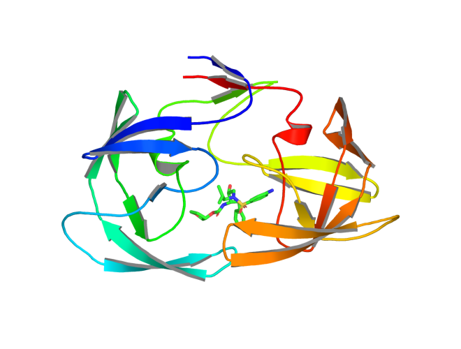

*Fig. 25. Resultado de `preset.publication`: hélices estilizadas, iluminação e antialiasing ajustados em um único comando.*

---

## 7. Cores e esquemas de coloração

A cor é o canal por onde a propriedade físico-química é transmitida. Um esquema deliberado transforma uma figura bonita em um argumento científico.

```pml
color grey80, polymer
util.cbc
util.cbag("chain A")
color atomic, not elem C
```

**O que faz.** Cor uniforme; cbc colore por cadeia; cbaX colore os carbonos de uma cor e mantém os demais elementos no padrão CPK; color atomic reaplica o CPK aos não-carbonos.

**Na interface.** `C > by chain` e `C > by element` no painel de objetos.

**Ganho de rotina.** As variantes `util.cbaX` (g verde, c ciano, y amarelo, s salmão, m magenta, w branco, b azul, o laranja, p roxo, k rosa) são a forma padrão de distinguir duas moléculas mantendo a leitura química: oxigênio sempre vermelho, nitrogênio sempre azul, apenas os carbonos mudam. Pelo menu C isso exige entrar em by element e escolher a variante certa, objeto por objeto.

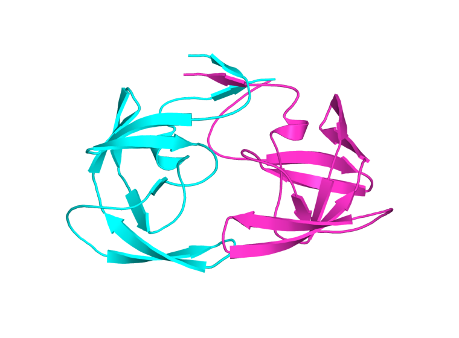

*Fig. 26. `util.cbc`, uma cor por cadeia, revelando imediatamente que a protease é um homodímero.*

```pml
spectrum count, rainbow, polymer and name CA
```

**O que faz.** Gradiente do N-terminal, em azul, ao C-terminal, em vermelho, ao longo da cadeia.

**Na interface.** `C > spectrum > rainbow`, sem controle sobre a restrição a Cα.

**Ganho de rotina.** Torna a topologia legível: permite seguir o caminho da cadeia em um feixe de hélices ou em um barril beta e identificar domínios contíguos em sequência.

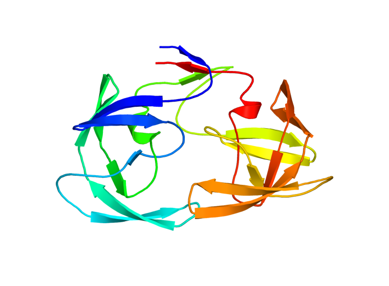

*Fig. 27. Gradiente N para C aplicado ao dímero. Como as duas cadeias são idênticas, o padrão de cor se repete e a simetria fica evidente.*

> **Atenção**  
> Restringir a `name CA` garante um gradiente por resíduo. Sem essa restrição o gradiente é por átomo e resíduos grandes recebem uma faixa maior de cor que os pequenos.

```pml
# sem limites: cada objeto e normalizado pela propria faixa
spectrum b, blue_white_red, cadeiaA and name CA
spectrum b, blue_white_red, cadeiaB and name CA

# com limites explicitos: as duas figuras passam a ser comparaveis
spectrum b, blue_white_red, cadeiaA and name CA, 15, 45
spectrum b, blue_white_red, cadeiaB and name CA, 15, 45
```

**O que faz.** Mapeia o B-factor em uma rampa de cor, com e sem limites numéricos explícitos.

**Na interface.** `C > spectrum > b-factor`, sempre com normalização automática.

**Ganho de rotina.** Fixar minimum e maximum é impossível pelo menu e obrigatório para comparar duas estruturas. Sem os limites, o PyMOL normaliza pelo intervalo de cada objeto e duas figuras com escalas diferentes parecem comparáveis quando não são, erro frequente em figuras publicadas.

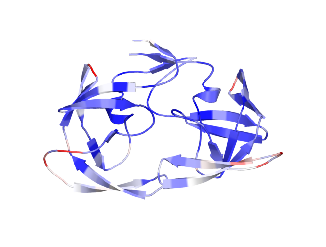

*Fig. 28. **Sem limites.** Cada cadeia é normalizada pela própria faixa de B, então as duas parecem igualmente móveis mesmo tendo intervalos numéricos diferentes.*

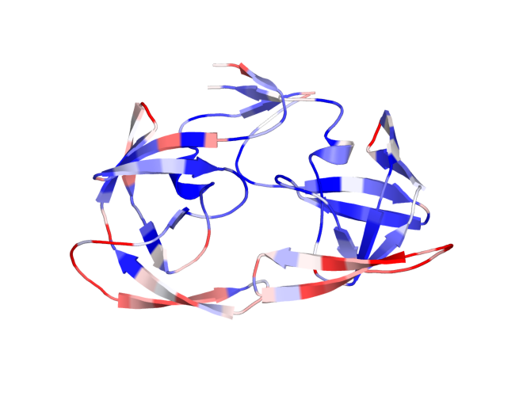

*Fig. 29. **Com limites 15 a 45.** A mesma cor passa a significar o mesmo valor nas duas cadeias, e a diferença real de mobilidade entre elas aparece.*

```pml
set_color meucinza, [0.85, 0.85, 0.85]
set_color laranja_kd, [0.90, 0.55, 0.15]
color meucinza, elem C
```

**O que faz.** Define uma cor nomeada a partir de valores RGB no intervalo 0 a 1.

**Na interface.** `Setting > Colors...` abre um seletor, mas a cor não fica nomeada nem reproduzível.

**Ganho de rotina.** Permite padronizar a paleta entre todas as figuras de um trabalho e escolher cores distinguíveis por daltônicos, o que rainbow não garante. Guardado no ~/.pymolrc, o esquema da tese fica disponível em toda sessão.

> **Paletas úteis para spectrum**  
> `rainbow`, `rainbow_rev`, `blue_white_red`, `red_white_blue`, `blue_white_orange`, `yellow_white_marine`, `green_white_magenta`, `white_red`. Para dados divergentes em torno de zero, como potencial eletrostático ou hidrofobicidade de Kyte-Doolittle, use sempre uma rampa com branco no centro e limites simétricos. Para dados apenas positivos, como SASA relativa ou desvio por resíduo, use uma rampa sequencial como `white_red`.

---

## 8. Perfil físico-químico I, hidrofobicidade

O objetivo é tornar visível por que a proteína se enovela: o núcleo apolar, a superfície polar e as exceções, que são as faces hidrofóbicas expostas. Estas quase sempre indicam sítio de interação, de ligação ou região transmembrana.

```pml
select apolar,   resn ALA+VAL+ILE+LEU+MET+PHE+TRP+PRO+GLY+CYS
select polar,    resn SER+THR+ASN+GLN+TYR+HIS
select acido,    resn ASP+GLU
select basico,   resn ARG+LYS

hide everything
show surface, polymer
color grey90,    polymer
color orange,    apolar
color palecyan,  polar
color firebrick, acido
color marine,    basico
deselect
```

**O que faz.** Classifica os resíduos em quatro classes químicas e pinta a superfície molecular de acordo.

**Na interface.** Inviável na prática: seriam quatro seleções construídas resíduo a resíduo pela faixa de sequência, mais quatro operações de cor.

**Ganho de rotina.** É o exemplo mais convincente do ganho de digitar. Dez linhas, coláveis em qualquer estrutura sem nenhuma alteração, produzem um mapa físico-químico completo. Guardadas em um alias, viram um único comando reutilizável em toda a rotina.

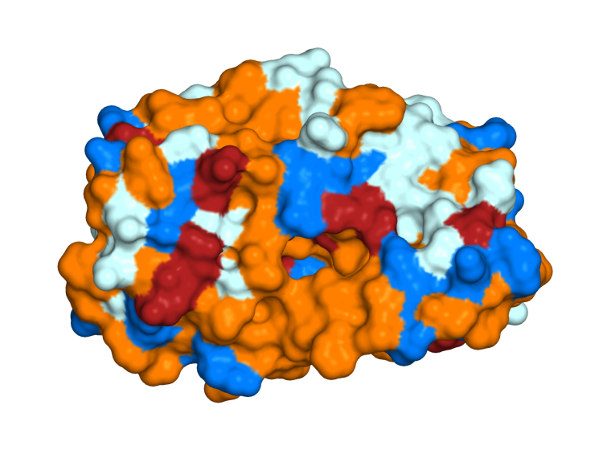

*Fig. 30. Superfície colorida por classe química: apolares em laranja, polares em ciano claro, ácidos em vermelho, básicos em azul. Manchas laranja contíguas na superfície são candidatas a sítio de interação.*

> **Atenção**  
> A classificação binária é uma simplificação. Glicina não é hidrofóbica em sentido termodinâmico, e triptofano e tirosina são anfipáticos, com anel apolar e grupo polar na mesma cadeia lateral. Vale explicitar isso e passar para a escala contínua abaixo.

```pml
# Escala Kyte-Doolittle gravada no campo B e mapeada em cor
alter polymer, b = 0.0
alter polymer and resn ILE, b =  4.5
alter polymer and resn VAL, b =  4.2
alter polymer and resn LEU, b =  3.8
alter polymer and resn PHE, b =  2.8
alter polymer and resn CYS, b =  2.5
alter polymer and resn MET, b =  1.9
alter polymer and resn ALA, b =  1.8
alter polymer and resn GLY, b = -0.4
alter polymer and resn THR, b = -0.7
alter polymer and resn SER, b = -0.8
alter polymer and resn TRP, b = -0.9
alter polymer and resn TYR, b = -1.3
alter polymer and resn PRO, b = -1.6
alter polymer and resn HIS, b = -3.2
alter polymer and resn GLU, b = -3.5
alter polymer and resn GLN, b = -3.5
alter polymer and resn ASP, b = -3.5
alter polymer and resn ASN, b = -3.5
alter polymer and resn LYS, b = -3.9
alter polymer and resn ARG, b = -4.5
rebuild
show surface, polymer
spectrum b, blue_white_orange, polymer, -4.5, 4.5
```

**O que faz.** Sobrescreve o B-factor com o índice de hidropatia de Kyte-Doolittle e usa spectrum para mapeá-lo em uma rampa divergente com limites simétricos.

**Na interface.** Sem qualquer equivalente, porque é um cálculo e não uma opção de menu.

**Ganho de rotina.** Substitui a classificação binária por uma escala contínua, quantitativa e citável. Mais do que isso, ensina o padrão geral mais útil da rotina: o campo B é apenas um contêiner numérico por átomo, e qualquer propriedade calculada, como conservação evolutiva, RMSF de dinâmica molecular ou escore de docking por resíduo, pode ser gravada nele e visualizada com spectrum. Aprender este bloco é aprender a visualizar qualquer variável por resíduo.

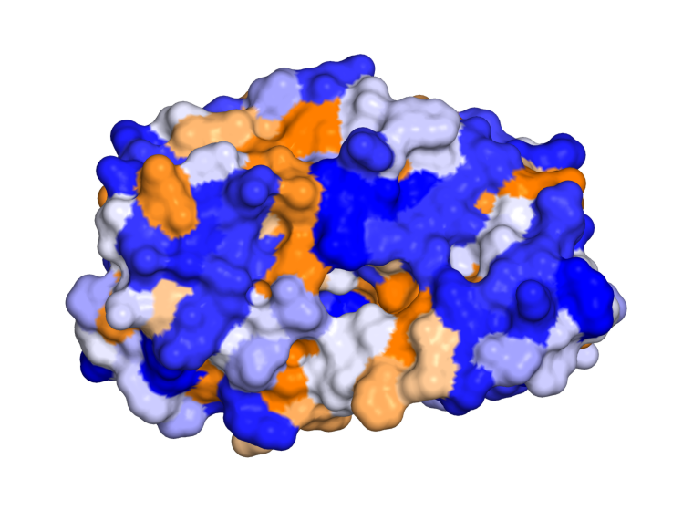

*Fig. 31. Superfície colorida pela escala de Kyte-Doolittle com limites simétricos: laranja para hidrofóbico, azul para hidrofílico, branco para neutro.*

> **Atenção**  
> Este bloco destrói o B-factor original. Trabalhe sobre uma cópia (`create tmp, 1hpv`) se ainda precisar dos valores cristalográficos, ou recarregue a estrutura depois.

```pml
show surface, polymer
set transparency, 0.3
color grey90, polymer
color orange, resn ALA+VAL+ILE+LEU+MET+PHE+TRP+PRO+CYS
show sticks, resn ALA+VAL+ILE+LEU+MET+PHE+TRP+CYS and sidechain and not hydro
clip slab, 14
```

**O que faz.** Corta uma fatia fina da molécula com a superfície translúcida e as cadeias laterais apolares em sticks.

**Na interface.** Combinação de cerca de dez operações de menu, mais o ajuste do corte pela roda do mouse.

**Ganho de rotina.** É a imagem que fecha o argumento do efeito hidrofóbico: a fatia mostra o núcleo apolar denso e a casca polar na mesma figura. Com valor numérico no clip, a mesma fatia é reproduzida em todas as estruturas da comparação.


*Fig. 32. Fatia de 14 Å. As cadeias laterais apolares, em laranja, preenchem o interior, enquanto a superfície mantém a casca polar.*

---

## 9. Perfil físico-químico II, carga e potencial eletrostático

Da coloração qualitativa por resíduos carregados ao mapa de potencial eletrostático. Boa oportunidade para discutir o que cada nível de aproximação de fato representa.

```pml
hide everything
show surface, polymer
color white,     polymer
color firebrick, resn ASP+GLU
color marine,    resn ARG+LYS
color palecyan,  resn HIS
```

**O que faz.** Coloração binária da superfície pelos resíduos formalmente carregados em pH fisiológico.

**Na interface.** Quatro seleções manuais mais quatro operações de cor.

**Ganho de rotina.** Rápido, sem dependências externas, e suficiente para identificar faces ácidas ou básicas: sítios de ligação a DNA e a heparina aparecem como manchas azuis contíguas. Tratar a histidina em separado permite discutir o pKa próximo de 6 e a dependência do pH.


*Fig. 33. **Face frontal.** Predomínio de resíduos básicos, em azul, ao redor da fenda catalítica.*


*Fig. 34. **Face posterior**, obtida com `turn y, 180`. A distribuição de carga é claramente diferente da face frontal.*

```pml
create prot, polymer
util.protein_vacuum_esp("prot", mode=2, quiet=0)

# a rampa criada automaticamente chama-se prot_e_pot e a superficie
# fica no objeto prot_e_chg; recrie a rampa com limites explicitos
ramp_new prot_e_pot, prot_e_map, [-15, 0, 15], [red, white, blue]
set surface_color, prot_e_pot, prot_e_chg
set surface_ramp_above_mode, 1
```

**O que faz.** Atribui cargas parciais e raios do campo de força Amber99, calcula o potencial de Coulomb em vácuo e cria três objetos: prot_e_chg (molécula com cargas, onde a superfície é desenhada), prot_e_map (o mapa) e prot_e_pot (a rampa de cor).

**Na interface.** `A > generate > vacuum electrostatics > protein contact potential`.

**Ganho de rotina.** Coloca um mapa eletrostático na tela em um comando, sem instalar nada. Recriar a rampa com limites explícitos é o que torna dois mapas comparáveis entre si, exatamente o mesmo princípio de fixar minimum e maximum em spectrum, e igualmente impossível pelo menu.

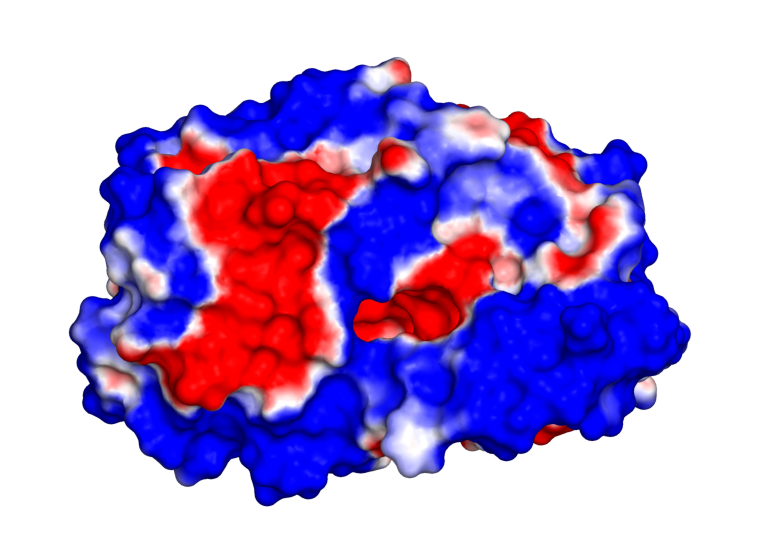

*Fig. 35. Potencial de contato em vácuo, rampa de menos 15 a mais 15 kT/e. A convenção da literatura é vermelho para potencial negativo e azul para positivo.*

> **Atenção**  
> Três armadilhas. O primeiro argumento tem de ser o nome de um objeto, não uma expressão de seleção. O objeto original é consumido e substituído por NOME_e_chg, de modo que desabilitá-lo por engano deixa a tela em branco. E o resultado é qualitativo: Coulomb em vácuo ignora a blindagem pelo solvente e a força iônica, superestimando o potencial a longa distância.

> **APBS, o mapa quantitativo**  
> No PyMOL 2.x: menu `Plugin > APBS Electrostatics`. O plugin prepara a estrutura com pdb2pqr (adiciona hidrogênios, atribui estados de protonação e cargas), resolve a equação de Poisson-Boltzmann linearizada e devolve um mapa que se aplica à superfície com os mesmos comandos `ramp_new` e `set surface_color` acima. Vale explicar em sala que a diferença para o mapa em vácuo não é cosmética: o cálculo de Poisson-Boltzmann modela solvente contínuo com constante dielétrica alta e íons em solução, e é esse o resultado que se reporta em publicação. No bundle oficial do PyMOL para macOS o executável `apbs` já vem incluído em `PyMOL.app/Contents/bin`, de modo que o plugin funciona sem instalação adicional.

```pml
select ponte_salina, byres ((resn ASP+GLU and name OD1+OD2+OE1+OE2) \
       within 4 of (resn ARG+LYS and name NH1+NH2+NE+NZ))
show sticks, ponte_salina and sidechain and not hydro
distance ps, (resn ASP+GLU and name OD1+OD2+OE1+OE2), \
             (resn ARG+LYS and name NH1+NH2+NE+NZ), 4.0
```

**O que faz.** Seleciona e mede pares iônicos entre cadeias laterais ácidas e básicas, usando apenas os átomos formalmente carregados.

**Na interface.** Sem equivalente.

**Ganho de rotina.** Levanta todas as pontes salinas da estrutura de uma vez, com o critério explícito no comando. Pontes salinas são determinante clássico de termoestabilidade e de especificidade em interfaces; restringir aos átomos terminais evita falsos positivos por proximidade de cadeia principal.

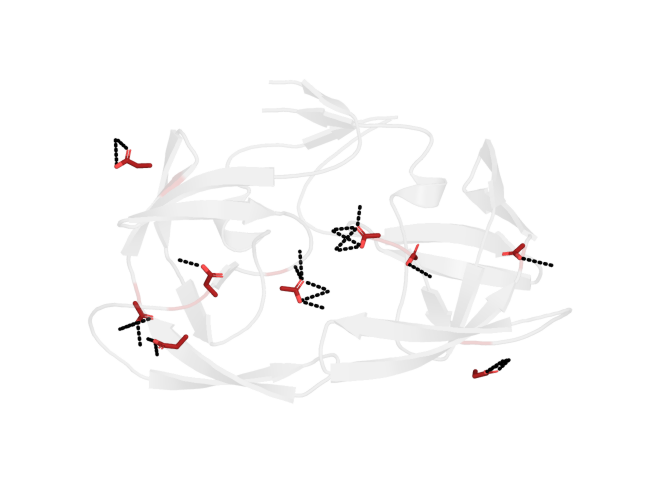

*Fig. 36. Pontes salinas da protease. Carboxilatos com carbonos em vermelho, grupos guanidínio e amônio com carbonos em azul, contatos a menos de 4 Å em tracejado preto.*

---

## 10. Perfil físico-químico III, exposição ao solvente

Da percepção visual de enterramento ao número. A área acessível ao solvente é a variável quantitativa mais acessível dentro do PyMOL e conecta a figura à termodinâmica de associação.

```pml
set dot_solvent, 1
set dot_density, 3
print cmd.get_area("polymer")
```

**O que faz.** dot_solvent 1 calcula a área acessível ao solvente (SASA, superfície de Lee-Richards); 0 calcula a superfície molecular de Connolly. dot_density controla a densidade de amostragem.

**Na interface.** `A > compute > get area`, que usa silenciosamente o valor corrente de dot_solvent.

**Ganho de rotina.** O ganho aqui é de rigor, não de tempo: declarar dot_solvent explicitamente antes de qualquer get_area evita comparar um valor de SASA com um valor de superfície molecular, um erro silencioso que o menu não previne. Num script, a declaração fica registrada junto com o resultado.

> **Atenção**  
> get_area exige que a seleção esteja contida em um único objeto; caso contrário retorna `Selection must be within a single object`. Hidrogênios alteram o valor, então padronize se vai calcular com ou sem eles.

```pml
# Area enterrada na interface (BSA), por monomero
create cadA, 1hpv and chain A
create cadB, 1hpv and chain B
create dimero, 1hpv and chain A+B
set dot_solvent, 1
print (cmd.get_area("cadA") + cmd.get_area("cadB") - cmd.get_area("dimero")) / 2.0
```

**O que faz.** Calcula a área enterrada por monômero na formação do complexo.

**Na interface.** Sem equivalente; a aritmética teria de ser feita à mão a partir de três valores obtidos separadamente.

**Ganho de rotina.** Transforma uma pergunta qualitativa em um número em cinco linhas, e o bloco serve para qualquer complexo trocando os nomes de cadeia. É a medida padrão do tamanho de uma interface e um bom critério para discutir se um contato cristalográfico é biologicamente relevante: interfaces de dímeros obrigatórios costumam enterrar bem mais de 800 a 1000 Ų por monômero, enquanto contatos de empacotamento cristalino ficam abaixo disso.

> **Atenção**  
> A divisão por dois converte a área total enterrada nas duas superfícies em área por monômero, que é a convenção mais comum. Deixe explícito qual convenção está em uso.

```python
python
from pymol import cmd

# SASA relativa por residuo: fracao da area do mesmo residuo isolado.
# Gravada no campo B e mapeada em cor (branco = enterrado, vermelho = exposto)
cmd.set("dot_solvent", 1)
cmd.set("dot_density", 3)

rel = cmd.get_sasa_relative("1hpv")
for (obj, segi, chain, resi), val in rel.items():
    cmd.alter(f"/{obj}/{segi}/{chain}/{resi}", f"b={val}")

cmd.rebuild()
cmd.show("surface", "polymer")
cmd.spectrum("b", "white_red", "polymer", 0.0, 1.0)
python end
```

**O que faz.** get_sasa_relative devolve, para cada resíduo, a razão entre sua SASA na estrutura e a SASA do mesmo tipo de resíduo em um tripeptídeo estendido de referência. O valor é gravado no campo B e mapeado em cor.

**Na interface.** Sem equivalente.

**Ganho de rotina.** Normalizar pelo tipo de resíduo é o que torna a comparação justa: 50 Ų expostos significam coisas opostas para glicina e para triptofano. Com o valor no campo B, qualquer seleção numérica passa a estar disponível, como `select expostos_apolares, byres (b > 0.4 and resn LEU+ILE+VAL+PHE+TRP)`, que lista em uma linha os candidatos a sítio funcional.

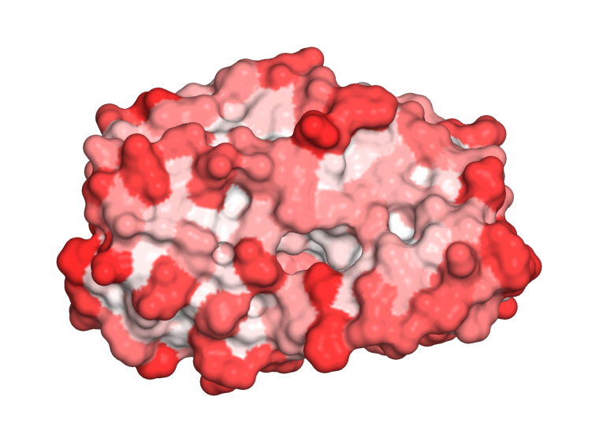

*Fig. 37. SASA relativa por resíduo: branco para resíduos enterrados, vermelho para expostos ao solvente.*

> **Atenção**  
> Disponível a partir do PyMOL 2.3. Atenção à sintaxe da macro: o formato correto é `/objeto/segi/cadeia/residuo`. Escrever as barras fora de ordem produz dezenas de `Selector-Error: Malformed selection` sem que nada seja alterado. Como nos blocos anteriores, o campo B original é sobrescrito.

```pml
set dot_solvent, 1
print cmd.get_area("resi 25 and sidechain")
print cmd.get_area("byres (polymer within 5 of organic)")
```

**O que faz.** Área acessível de uma cadeia lateral específica ou de todo o sítio de ligação.

**Na interface.** `A > compute > get area` sobre uma seleção previamente montada a cliques.

**Ganho de rotina.** Permite quantificar afirmações que os alunos fazem só de olhar, como dizer que um triptofano está enterrado ou que o bolso é raso. Comparar o valor antes e depois de remover o ligante mede diretamente o enterramento do sítio, em dois comandos.

---

## 11. Interações: ligações de hidrogênio, contatos e bolsos

Da visão geral de propriedades para a geometria dos contatos individuais. É aqui que a aula liga estrutura a mecanismo.

```pml
distance hb, polymer, organic, 3.5, mode=2
set dash_color, black
set dash_width, 3.5
hide labels, hb
```

**O que faz.** mode=2 aplica o critério interno de ligação de hidrogênio, que combina distância e ângulo entre doador e aceptor, em vez de um corte puramente por distância.

**Na interface.** `A > find > polar contacts > to other atoms in object`.

**Ganho de rotina.** O menu oferece cinco variantes de polar contacts e nenhuma permite escolher o corte de distância nem nomear o objeto resultante. Pelo comando, o critério fica explícito e o objeto recebe um nome que pode ser ligado e desligado nas cenas.

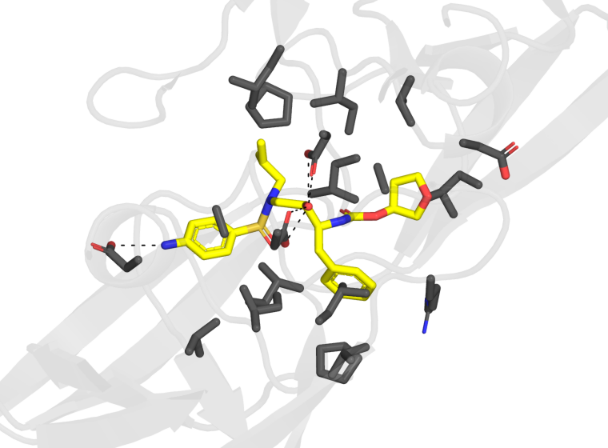

*Fig. 38. Ligações de hidrogênio entre o inibidor, em amarelo, e a protease, calculadas com `mode=2` e corte de 3,5 Å. Rótulos ocultos para legibilidade.*

```pml
set h_bond_cutoff_center, 3.6
set h_bond_cutoff_edge, 3.2
set h_bond_max_angle, 63
```

**O que faz.** Ajusta os limites de distância, ideal e máximo, e o desvio angular máximo do critério de ligação de hidrogênio.

**Na interface.** Só por `Setting > Edit All`, buscando cada setting pelo nome.

**Ganho de rotina.** Mostrar ao vivo como a contagem de ligações de hidrogênio muda ao afrouxar o critério é a maneira mais eficaz de comunicar que número de ligações de hidrogênio não é um observável, e sim o resultado de uma definição escolhida. Pelo comando, a demonstração leva dez segundos.

```pml
h_add polymer
distance hb, polymer, organic, mode=2
remove hydro
```

**O que faz.** Adiciona hidrogênios com geometria padrão; remove hydro os elimina.

**Na interface.** `A > hydrogens > add` e `A > hydrogens > remove`.

**Ganho de rotina.** Estruturas de difração de raios X em resolução usual não têm hidrogênios, e a geometria de ligação de hidrogênio depende deles. Alternar entre com e sem hidrogênios por comando permite mostrar a diferença no resultado em segundos.

> **Atenção**  
> h_add usa geometria idealizada; não otimiza a orientação de OH e NH3+ nem resolve o flip de Asn, Gln e His. Para trabalho quantitativo, use pdb2pqr, reduce ou MolProbity.

```pml
distance d1, /1hpv//A/25/OD1, /1hpv//B/25/OD2
angle a1, /1hpv//A/25/CG, /1hpv//A/25/OD1, /1hpv//A/25/OD2
dihedral chi1, /1hpv//A/25/N, /1hpv//A/25/CA, \
               /1hpv//A/25/CB, /1hpv//A/25/CG
```

**O que faz.** Mede distância, ângulo e diedro entre átomos individuais, com rótulo persistente na cena.

**Na interface.** `Wizard > Measurement`, clicando nos átomos na tela.

**Ganho de rotina.** O assistente exige localizar cada átomo visualmente e clicar com precisão, o que é lento e propenso a erro em regiões densas. Pela macro, a medida é declarada, reprodutível e reaproveitável em outra estrutura com a mesma numeração. Diedros são o caminho natural para discutir rotâmeros e verificar se o modelo colocou uma cadeia lateral em confôrmero improvável.

> **Atenção**  
> Cada seleção precisa resolver para exatamente um átomo. Com dois objetos carregados, `resi 25 and name CA` casa em ambos e retorna `More than one atom found`; prefixe sempre com o nome do objeto.

```pml
select contatos, byres (chain A within 4.0 of chain B)
show sticks, contatos and sidechain and not hydro
util.cbac("contatos and chain A")
util.cbay("contatos and chain B")
distance polares, chain A, chain B, 3.5, mode=2
```

**O que faz.** Isola os resíduos de interface, colore cada lado com carbonos de cor distinta e desenha as interações polares entre as cadeias.

**Na interface.** Sequência longa de seleções e menus de cor, refeita por inteiro a cada estrutura.

**Ganho de rotina.** Receita completa de figura de interface em cinco linhas, coláveis em qualquer complexo trocando as letras das cadeias. As cores distintas de carbono deixam claro qual resíduo pertence a qual parceiro, mantendo a leitura CPK dos heteroátomos.


*Fig. 39. Interface do dímero: cadeia A com carbonos ciano, cadeia B com carbonos amarelos, sobre cartoon translúcido.*

```pml
show surface, byres (polymer within 9 of organic)
set transparency, 0.1
show sticks, organic
util.cbay("organic")
orient organic
zoom organic, 5
```

**O que faz.** Renderiza a superfície apenas da vizinhança do ligante, com o ligante em sticks e carbonos amarelos.

**Na interface.** Exige criar antes um objeto separado com a vizinhança, porque não há como restringir a superfície a uma seleção pelo menu.

**Ganho de rotina.** Além de produzir uma figura de bolso muito mais limpa, é bem mais rápido de renderizar do que a superfície da proteína inteira, diferença que se sente em cada ray de sistemas grandes.

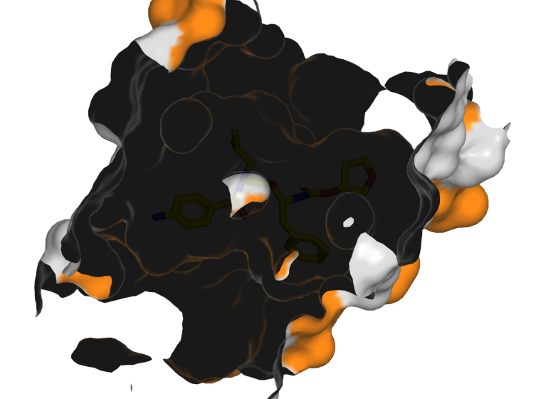

*Fig. 40. Bolso de ligação com as paredes apolares em laranja. A complementaridade de forma com o inibidor fica evidente.*

---

## 12. Avaliação de modelos

O bloco mais próximo do trabalho cotidiano de modelagem: superposição, RMSD, confiança por resíduo e detecção de problemas geométricos.

```pml
align modelo, referencia
super modelo, referencia
cealign referencia, modelo
```

**O que faz.** Três algoritmos de superposição. align parte do alinhamento de sequência e refina por ciclos de rejeição de outliers; super usa características estruturais e independe da identidade de sequência; cealign implementa o Combinatorial Extension, puramente estrutural.

**Na interface.** `A > align > all to this`, que usa align, e `A > align > cealign`.

**Ganho de rotina.** Além de mais rápido, é o único caminho que expõe os parâmetros. Regra prática: align para identidade de sequência acima de cerca de 30%, super para identidade baixa, cealign para folds distantes ou quando os outros falham. Atenção à ordem dos argumentos, porque em cealign o primeiro é o alvo fixo, ao contrário dos outros dois.

```pml
align modelo, referencia, cycles=0
align modelo////CA, referencia////CA
```

**O que faz.** cycles=0 desliga a rejeição iterativa de outliers; a forma com macro restringe o cálculo aos Cα.

**Na interface.** Sem equivalente, porque o menu sempre usa os cinco ciclos padrão.

**Ganho de rotina.** Este é o ponto crítico da seção e um argumento decisivo para digitar em vez de clicar. Por padrão, align descarta os pares mais divergentes ao longo de cinco ciclos e reporta o RMSD apenas dos que sobraram, um número sistematicamente otimista. Quem só usa o menu nunca vê essa diferença. A prática correta é comparar o RMSD com cycles=0 e o padrão, e reportar também o número de átomos alinhados.

> **Atenção**  
> align retorna sete valores: RMSD após refinamento, número de átomos alinhados, número de ciclos, RMSD antes do refinamento, número de átomos antes, escore do alinhamento de sequência e número de resíduos alinhados. Em Python: `cmd.align('modelo','referencia')`.

```pml
rms_cur modelo, referencia
```

**O que faz.** Calcula o RMSD sobre as posições atuais, sem mover nada; exige correspondência átomo a átomo.

**Na interface.** Sem equivalente.

**Ganho de rotina.** É o comando correto para avaliar um modelo já posicionado, como uma pose de docking em relação à pose cristalográfica, onde superpor destruiria justamente a informação que se quer medir. Confundir rms_cur com align é um erro que invalida silenciosamente a avaliação.

```python
python
from pymol import cmd

# Desvio por residuo apos superposicao, gravado em B e mapeado em cor
cmd.align("modelo", "referencia")
for at in cmd.get_model("modelo and name CA").atom:
    sel_m = f"modelo//{at.chain}/{at.resi}/CA"
    sel_r = f"referencia//{at.chain}/{at.resi}/CA"
    if cmd.count_atoms(sel_r) == 1:
        d = cmd.get_distance(sel_m, sel_r)
        cmd.alter(f"modelo//{at.chain}/{at.resi}/", f"b={d}")

cmd.rebuild()
cmd.show("cartoon", "modelo")
cmd.spectrum("b", "white_red", "modelo and polymer", 0.0, 2.0)
python end
```

**O que faz.** Após a superposição, mede a distância Cα-Cα resíduo a resíduo, grava no campo B e colore.

**Na interface.** Sem equivalente.

**Ganho de rotina.** O RMSD global é um único número e esconde a informação mais útil, que é onde o modelo erra. Este mapa mostra imediatamente se o desvio está concentrado em loops e terminais, o que é aceitável, ou distribuído pelo núcleo estruturado, o que compromete o modelo. É o bloco que mais poupa tempo na rotina de quem avalia modelos em série.

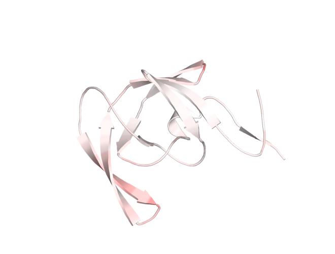

*Fig. 41. Aplicação real do bloco: a cadeia B da protease superposta à cadeia A, colorida pelo desvio Cα-Cα de 0 a 2 Å. Duas cópias quimicamente idênticas divergem justamente nos loops e nas flaps, e o núcleo em folha beta permanece branco.*

```pml
# pLDDT do AlphaFold, gravado no campo B
color grey60,  polymer
color orange,  polymer and b < 50
color yellow,  polymer and b > 50 and b < 70
color skyblue, polymer and b > 70 and b < 90
color blue,    polymer and b > 90
```

**O que faz.** Aplica a convenção de cores do AlphaFold DB às faixas de confiança pLDDT armazenadas no campo B.

**Na interface.** Sem equivalente, porque o menu só oferece o gradiente contínuo de b-factor.

**Ganho de rotina.** Reproduz exatamente a leitura oficial do modelo, em faixas discretas em vez de gradiente contínuo: acima de 90 confiança muito alta, de 70 a 90 confiança boa no backbone, de 50 a 70 baixa, abaixo de 50 tipicamente região intrinsecamente desordenada e não uma estrutura errada. Salvo no ~/.pymolrc como alias plddt, avalia qualquer predição em um comando.

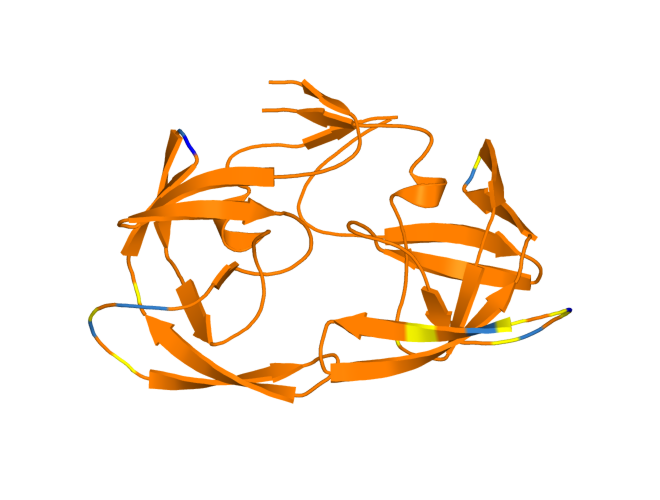

*Fig. 42. Esquema de faixas ilustrado sobre o B-factor cristalográfico da protease, normalizado para 0 a 100. Em um arquivo do AlphaFold, azul escuro seria confiança muito alta e laranja região provavelmente desordenada.*

> **Atenção**  
> Cuidado com a inversão de sentido. No arquivo cristalográfico, B alto significa incerteza; no arquivo do AlphaFold, B alto significa confiança. Verifique sempre a origem do arquivo antes de interpretar uma coloração por B.

```pml
cartoon putty, polymer
set cartoon_putty_scale_min, 0.5
set cartoon_putty_scale_max, 4.0
set cartoon_putty_transform, 0
spectrum b, blue_white_red, polymer and name CA
rebuild
```

**O que faz.** Representação putty, em que a espessura do tubo varia com o valor do campo B, aqui combinada com a cor.

**Na interface.** `S > as > putty`; os parâmetros de escala só por `Setting > Edit All`.

**Ganho de rotina.** Codifica a mesma variável em dois canais visuais, espessura e cor, o que a torna legível mesmo em projeção ruim ou impressão em preto e branco. É a representação padrão para mostrar mobilidade cristalográfica.

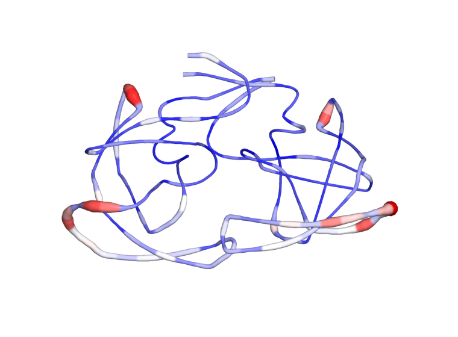

*Fig. 43. Putty por B-factor: tubo mais espesso e mais vermelho onde a mobilidade é maior, tipicamente loops e extremidades.*

> **Atenção**  
> Exige variação real nos valores de B. Se todos forem iguais, o PyMOL emite `invalid putty settings (division by zero)` e nada é desenhado.

```python
python
from pymol import cmd

# Contatos estericos: atomos pesados de residuos nao vizinhos com
# sobreposicao de raios de van der Waals acima de 0.4 A
sel = "polymer and not hydro"
info = {}
cmd.iterate(sel, "info[index] = (chain, resv, name, vdw)", space={"info": info})

vistos, clashes = set(), []
for (o1, i1), (o2, i2) in cmd.find_pairs(sel, sel, cutoff=4.0, angle=0):
    if (i2, i1) in vistos:
        continue
    vistos.add((i1, i2))
    c1, r1, n1, v1 = info[i1]
    c2, r2, n2, v2 = info[i2]
    if c1 == c2 and abs(r1 - r2) < 2:
        continue                                  # ignora vizinhos na cadeia
    d = cmd.get_distance(f"{o1} and index {i1}", f"{o2} and index {i2}")
    ov = (v1 + v2) - d
    if ov > 0.4:
        clashes.append((f"{c1}/{r1}/{n1}", f"{c2}/{r2}/{n2}", round(d, 2), round(ov, 2)))

print(len(clashes), "contatos com sobreposicao > 0.4 A")
for c in sorted(clashes, key=lambda x: -x[3])[:15]:
    print(c)
python end
```

**O que faz.** Lista pares de átomos pesados de resíduos não vizinhos cujos raios de van der Waals se sobrepõem além de um limiar.

**Na interface.** Sem equivalente.

**Ganho de rotina.** Clashes estéricos são o defeito mais comum de modelos comparativos e de poses de docking, e não aparecem em nenhuma representação padrão. Uma triagem que levaria uma submissão a servidor externo e minutos de espera roda localmente em segundos, e o bloco serve para qualquer modelo sem alteração. O filtro de resíduos vizinhos é necessário porque átomos covalentemente ligados e 1-3 sempre se sobrepõem por definição.

> **Atenção**  
> É uma triagem rápida e não substitui validação completa. Para relatório formal use MolProbity, que também avalia rotâmeros, Ramachandran e flips de Asn, Gln e His.

```python
python
from pymol import cmd
pp = cmd.get_phipsi("polymer and name CA")
for k in sorted(pp):
    print(k, [round(v, 1) for v in pp[k]])
python end
```

**O que faz.** Extrai os ângulos diedros phi e psi da cadeia principal, resíduo a resíduo.

**Na interface.** Sem equivalente.

**Ganho de rotina.** Permite exportar os valores para gerar um gráfico de Ramachandran em matplotlib, conectando a visualização à análise quantitativa em Python e identificando resíduos em regiões proibidas, tudo sem sair da sessão.

```pml
sculpt_activate modelo
sculpt_iterate modelo, cycles=200
sculpt_deactivate modelo
```

**O que faz.** Ativa o campo de força interno do PyMOL, com restrições de ligação, ângulo, planaridade e repulsão de van der Waals, e roda ciclos de minimização.

**Na interface.** `A > sculpting` e o painel de edição.

**Ganho de rotina.** Alívio rápido de contatos estéricos leves e de geometria local distorcida, útil como demonstração ao vivo do efeito e para limpar um modelo antes de gerar a figura.

> **Atenção**  
> O sculpting é um campo de força simplificado, sem eletrostática nem solvente. Serve para limpeza cosmética e demonstração; refinamento sério exige GROMACS, OpenMM, Amber ou equivalente.

---

## 13. Renderização, exportação e automação

Como transformar a tela em figura utilizável, e como não repetir amanhã o trabalho de hoje.

```pml
png figura.png, width=2400, height=1800, dpi=300, ray=1
```

**O que faz.** Renderiza com ray tracing e grava um PNG com as dimensões e a resolução especificadas.

**Na interface.** `File > Export Image As > PNG...`, que abre um diálogo com campos equivalentes.

**Ganho de rotina.** Uma linha no fim do script gera a figura final junto com a cena, sem passar por diálogos. Quando um revisor pede a mesma figura com outra cor, basta trocar uma linha e reexecutar. O argumento ray=1 produz sombras, iluminação e antialiasing de qualidade de publicação, muito acima da captura de tela. Para coluna simples a 300 dpi, use largura em torno de 1000 a 1200 px.

```pml
set ray_opaque_background, 0
set ray_shadows, 0
set antialias, 2
ray 2400, 1800
png figura.png
```

**O que faz.** Renderiza na memória com fundo transparente e sem sombras; png grava o resultado já renderizado.

**Na interface.** Botão `Draw` ou `Ray` na barra inferior, seguido de `File > Save Image`.

**Ganho de rotina.** Separar ray de png permite renderizar uma vez e salvar em vários formatos ou testar ajustes de imagem sem refazer o cálculo, que é a etapa cara.

```pml
@aula.pml
run analise.py
log_open aula_log.pml
```

**O que faz.** O símbolo @ executa um arquivo de comandos .pml linha a linha; run executa um script Python; log_open registra tudo o que for digitado ou gerado por cliques.

**Na interface.** `File > Run Script...` e `File > Log > Open`.

**Ganho de rotina.** log_open é o melhor recurso de aprendizado da ferramenta: o aluno explora pela interface gráfica e, ao final, tem um script reproduzível de tudo o que fez, incluindo os comandos gerados por cada clique de menu. É a forma mais rápida de converter uso exploratório em rotina automatizada.

> **Atenção**  
> Dentro de um .pml, sempre use fetch com async=0. Lembre também que o diretório de trabalho é aquele de onde o PyMOL foi iniciado, não o do script.

```pml
# em ~/.pymolrc
alias sitio, hide everything; show cartoon, polymer; show sticks, organic; \
             set cartoon_side_chain_helper, 1; orient organic; zoom organic, 5
alias plddt, color grey60, polymer; color orange, polymer and b < 50; \
             color yellow, polymer and b > 50 and b < 70; \
             color skyblue, polymer and b > 70 and b < 90; color blue, polymer and b > 90
set_key F3, cmd.turn("y", 90)
```

**O que faz.** alias cria um comando novo a partir de uma sequência; set_key liga uma tecla de função a uma ação Python.

**Na interface.** Sem equivalente.

**Ganho de rotina.** É o mecanismo central de agilidade na rotina. Toda combinação que você digita mais de duas vezes deve virar um alias no ~/.pymolrc, que é lido automaticamente a cada início de sessão. Em sala, reduz a aula a poucos comandos memoráveis e elimina o risco de erro de digitação ao vivo.

---

## 14. Armadilhas frequentes

Erros que aparecem em quase toda turma e que vale antecipar.

| Sintoma | Causa | Correção |
| --- | --- | --- |
| A molécula desapareceu da tela | Planos de corte movidos pela roda do mouse | `clip slab, 200` seguido de `reset` ou `zoom` |
| `Selector-Error: Invalid selection name` logo após um fetch em script | Download assíncrono, o objeto ainda não existe | `fetch 1hpv, async=0` |
| Cartoon todo em loop, sem hélices nem folhas | Arquivo de modelo sem registros HELIX e SHEET | `dss` |
| Cadeias laterais atravessadas pelo cartoon | Cartoon desenhado sobre a cadeia principal em sticks | `set cartoon_side_chain_helper, 1` |
| Cadeias laterais cortadas ao meio | Seleção por distância sem expansão para o resíduo | Envolver a expressão em `byres (...)` |
| `Selection must be within a single object` | `get_area` recebeu seleção abrangendo mais de um objeto | Restringir ao objeto ou criar um objeto novo com `create` |
| `More than one atom found` em distance ou dihedral | Seleção casa com átomos homônimos em vários objetos | Usar macro com o nome do objeto: `/1hpv//A/25/CA` |
| Dezenas de `Malformed selection` em um loop de alter | Macro montada com o número errado de barras | Formato correto: `/objeto/segi/cadeia/residuo` |
| Tela em branco depois de gerar o mapa eletrostático | O objeto com a superfície é `NOME_e_chg`, e não `NOME_e_pot`, que é a rampa | Habilitar `NOME_e_chg` |
| Duas figuras de B-factor parecem comparáveis mas não são | `spectrum` sem limites normaliza por objeto | `spectrum b, blue_white_red, sele, 20, 80` |
| Coloração por B-factor com significado invertido | Arquivo do AlphaFold, em que B contém pLDDT e alto é bom | Verificar a origem do arquivo antes de interpretar |
| B-factor original perdido | Blocos de Kyte-Doolittle ou SASA sobrescrevem o campo B | Trabalhar sobre `create tmp, obj` ou recarregar |
| RMSD suspeitosamente baixo | `align` descarta outliers por padrão | `align a, b, cycles=0` e reportar o número de átomos alinhados |
| O dímero não aparece | Carregada a unidade assimétrica, não a montagem biológica | `fetch CODIGO, type=pdb1` ou `set assembly, 1` |
| Superfície demora minutos para aparecer | Estrutura grande com `surface_quality 1` | `set surface_quality, 0` e renderizar só a região de interesse |

---

## 15. Roteiro sugerido para a aula

Sequência de blocos que constrói o argumento do global ao local, terminando na avaliação do modelo. Cada bloco vira uma cena armazenada, navegável com Page Up e Page Down.


*Fig. 44. **Cena 1.** Visão global, cores por cadeia*


*Fig. 45. **Cena 2.** Topologia, gradiente N para C*


*Fig. 46. **Cena 3.** Forma, superfície translúcida*


*Fig. 47. **Cena 4.** Perfil físico-químico por classe*


*Fig. 48. **Cena 5.** Núcleo hidrofóbico em corte*


*Fig. 49. **Cena 6.** Bolso de ligação*


*Fig. 50. **Cena 7.** Interações no sítio ativo*


*Fig. 51. **Extra.** Cavidades internas*

```pml
# ---------------------------------------------------------------
# Aula de visualizacao e propriedades fisico-quimicas
# Curso de Bioinformatica Basica, 18 a 20 de agosto de 2026
# Estrutura: protease do HIV-1 com inibidor (dimero + ligante)
# ---------------------------------------------------------------

# --- Bloco 1: primeiro contato ---
reinitialize
set seq_view, 1
bg_color white
set orthoscopic, on
fetch 1hpv, async=0
remove solvent
hide everything
show cartoon, polymer
show sticks, organic
util.cbc
util.cbay("organic")
orient polymer
scene 01_global, store

# --- Bloco 2: topologia e simetria ---
spectrum count, rainbow, polymer and name CA
scene 02_topologia, store

# --- Bloco 3: forma e superficie ---
show surface, polymer
set transparency, 0.5
scene 03_superficie, store

# --- Bloco 4: perfil fisico-quimico ---
select apolar, resn ALA+VAL+ILE+LEU+MET+PHE+TRP+PRO+GLY+CYS
select acido,  resn ASP+GLU
select basico, resn ARG+LYS
set transparency, 0
color grey90, polymer
color orange, apolar
color firebrick, acido
color marine, basico
deselect
scene 04_fisicoquimico, store

# --- Bloco 5: nucleo hidrofobico em corte ---
set transparency, 0.3
show sticks, apolar and sidechain and not hydro
clip slab, 14
scene 05_nucleo, store

# --- Bloco 6: bolso de ligacao ---
clip slab, 200
hide surface
show surface, byres (polymer within 9 of organic)
set transparency, 0.1
orient organic
zoom organic, 5
scene 06_bolso, store

# --- Bloco 7: interacoes no sitio ---
hide surface
set cartoon_side_chain_helper, 1
show sticks, byres (polymer within 4.2 of organic) and sidechain and not hydro
distance hb, polymer, organic, 3.5, mode=2
hide labels, hb
set dash_color, black
scene 07_interacoes, store

save aula.pse

# Navegue entre as cenas com Page Up e Page Down
```

**O que faz.** Script completo que monta sete cenas encadeadas sobre a protease do HIV-1 e salva a sessão.

**Na interface.** Reproduzir isso a cliques leva de vinte a trinta minutos e não é reexecutável.

**Ganho de rotina.** Prepare e teste na véspera, salve o .pse e apresente navegando pelas cenas. Elimina o risco de erro de digitação ao vivo, libera atenção para a discussão e permite distribuir a sessão pronta aos alunos ao final. Substitua 1hpv pela estrutura do seu sistema, porque nenhum comando depende dessa entrada específica.

```pml
# reproduz localmente todas as 39 figuras deste guia
pymol -cq gerar_figuras_aula.py

# no macOS, se o comando pymol nao estiver no PATH:
/Applications/PyMOL.app/Contents/bin/pymol -cq gerar_figuras_aula.py
```

**O que faz.** Executa o script que acompanha este guia e grava as 39 figuras em ./figuras_pymol/, em 1200 por 900 px a 300 dpi, com os mesmos nomes usados aqui.

**Na interface.** Sem equivalente. É exatamente o tipo de tarefa que só existe por script.

**Ganho de rotina.** Todas as imagens deste material são reprodutíveis na sua máquina em cerca de dois minutos, a partir de um único fetch do PDB. Serve como demonstração final do argumento do guia inteiro: uma sessão exploratória feita a cliques morre com a janela, enquanto um script executado uma vez gera um conjunto completo de figuras consistentes entre si e refazíveis a qualquer momento.

> **Atenção**  
> O script usa `cmd.fetch`, portanto precisa de rede na primeira execução. A partir da segunda, o arquivo vem do cache definido por `fetch_path`.

---

## Contato

**Madson Allan de Luna Aragão**  
PhD Student in Bioinformatics @ UFMG  
Belo Horizonte, Minas Gerais, Brazil

- E-mail: [madsondeluna@gmail.com](mailto:madsondeluna@gmail.com)
- LinkedIn: [linkedin.com/in/madsonaragao](https://www.linkedin.com/in/madsonaragao/)
- Web: [madsondeluna.com](https://madsondeluna.com)
- GitHub: [github.com/madsondeluna](https://github.com/madsondeluna)
- ORCID: [0000-0001-5313-3913](https://orcid.org/0000-0001-5313-3913)
- Lattes: [0893799887546498](http://lattes.cnpq.br/0893799887546498)

Sintaxe verificada em PyMOL open-source. Os comandos são digitados na linha de comando do PyMOL, um por linha, ou reunidos em um arquivo `.pml` executado com `@arquivo.pml`. Blocos que começam com `python` e terminam com `python end` são executados pelo interpretador Python embutido.

Para reproduzir localmente todas as figuras deste guia:

```bash
pymol -cq gerar_figuras_aula.py
```

---

## 16. Curso em vídeo da Schrödinger

Os comandos deste guia cobrem o que se digita. O que se vê em movimento, a janela sendo operada, a cena sendo montada e o filme sendo exportado, aparece melhor em vídeo. A playlist [Visualizing Science with PyMOL 3](https://www.youtube.com/playlist?list=PL3dxdlKx_Pccw7CXrgeF6_zWQFT7zifyl) é do canal oficial da Schrödinger, a empresa que mantém e distribui o PyMOL, e está em inglês.

Os dezessete vídeos estão na ordem da playlist. As unidades 1 e 2 tratam da sessão, das seleções e da imagem estática, e são as que correspondem ao conteúdo deste guia. As unidades 3 e 4 tratam de cena, linha do tempo e filme, e passam pelo Maestro, que é outro programa da mesma empresa e não é necessário para nada aqui.

| Unidade | Vídeo | Duração |
| --- | --- | --- |
| - | [PyMOL 3 Course Promotional Video](https://www.youtube.com/watch?v=o7IZ726D5Uk&list=PL3dxdlKx_Pccw7CXrgeF6_zWQFT7zifyl) | 1:23 |
| 1A | [Course scope, certification, and honor code](https://www.youtube.com/watch?v=SRCYeW31X3g&list=PL3dxdlKx_Pccw7CXrgeF6_zWQFT7zifyl) | 5:13 |
| 1B | [Introducing PyMOL 3](https://www.youtube.com/watch?v=S5sUmNR2cBg&list=PL3dxdlKx_Pccw7CXrgeF6_zWQFT7zifyl) | 12:58 |
| 2A | [Getting started with a PyMOL 3 session](https://www.youtube.com/watch?v=IvLI9ECRMPI&list=PL3dxdlKx_Pccw7CXrgeF6_zWQFT7zifyl) | 10:21 |
| 2B | [Defining and styling objects and selections](https://www.youtube.com/watch?v=4m7s8v35vXE&list=PL3dxdlKx_Pccw7CXrgeF6_zWQFT7zifyl) | 12:08 |
| 2C | [Inspecting structures for scientific storytelling](https://www.youtube.com/watch?v=LqoF1ur9xsk&list=PL3dxdlKx_Pccw7CXrgeF6_zWQFT7zifyl) | 10:56 |
| 2D | [Binding pocket selections, interactions and labeling](https://www.youtube.com/watch?v=8iHyvgHzIpU&list=PL3dxdlKx_Pccw7CXrgeF6_zWQFT7zifyl) | 7:33 |
| 2E | [Creating and editing presets in PyMOL 3](https://www.youtube.com/watch?v=bG7MTKEwuu8&list=PL3dxdlKx_Pccw7CXrgeF6_zWQFT7zifyl) | 9:04 |
| 2F | [Saving views, generating images, and ray tracing](https://www.youtube.com/watch?v=98TKujGh430&list=PL3dxdlKx_Pccw7CXrgeF6_zWQFT7zifyl) | 15:01 |
| 3A | [Creating scenes in Maestro to sell a scientific story](https://www.youtube.com/watch?v=zDwhXwM6ASY&list=PL3dxdlKx_Pccw7CXrgeF6_zWQFT7zifyl) | 11:25 |
| 3B | [Sending scenes from Maestro to PyMOL to create a movie](https://www.youtube.com/watch?v=Y_83nFM2VEk&list=PL3dxdlKx_Pccw7CXrgeF6_zWQFT7zifyl) | 7:22 |
| 3C | [Saving scenes in PyMOL 3 to create a movie](https://www.youtube.com/watch?v=GYCMZ7T_h28&list=PL3dxdlKx_Pccw7CXrgeF6_zWQFT7zifyl) | 10:08 |
| 4A | [Transforming objects with the gizmo and saving camera views](https://www.youtube.com/watch?v=510XMNDzOII&list=PL3dxdlKx_Pccw7CXrgeF6_zWQFT7zifyl) | 12:27 |
| 4B | [Adding timeline programs and transparency subtracks](https://www.youtube.com/watch?v=wcIJ3KhO1NA&list=PL3dxdlKx_Pccw7CXrgeF6_zWQFT7zifyl) | 9:42 |
| 4C | [Creating multi-state movies and applying styling with subtracks and scenes](https://www.youtube.com/watch?v=r6yIHj4KLIM&list=PL3dxdlKx_Pccw7CXrgeF6_zWQFT7zifyl) | 10:05 |
| 4D | [Making movies with molecular dynamics trajectories](https://www.youtube.com/watch?v=A4CumjOBMVw&list=PL3dxdlKx_Pccw7CXrgeF6_zWQFT7zifyl) | 12:49 |
| 4E | [Course summary and assignment checklist](https://www.youtube.com/watch?v=6UkLPaxSN8U&list=PL3dxdlKx_Pccw7CXrgeF6_zWQFT7zifyl) | 3:45 |

